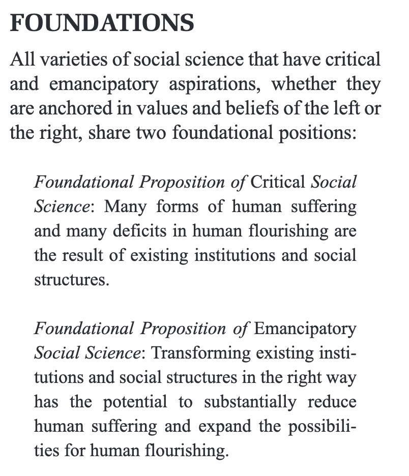
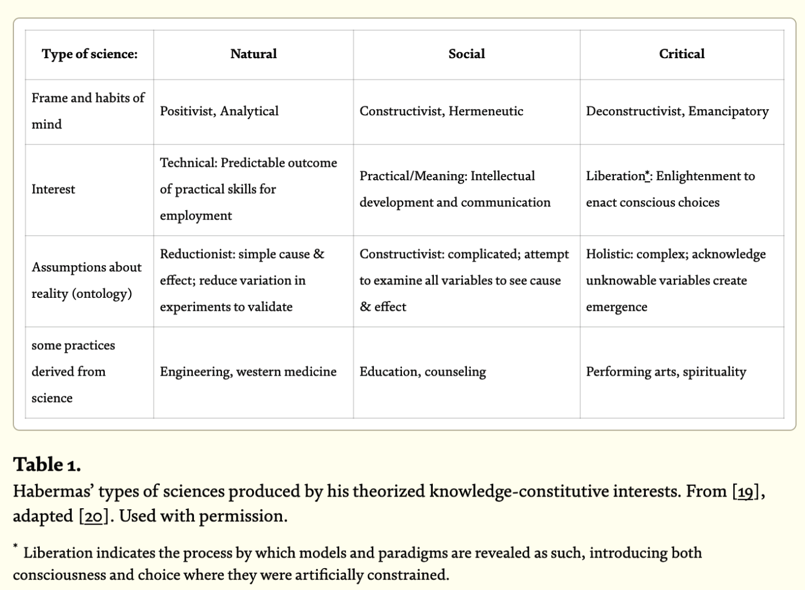
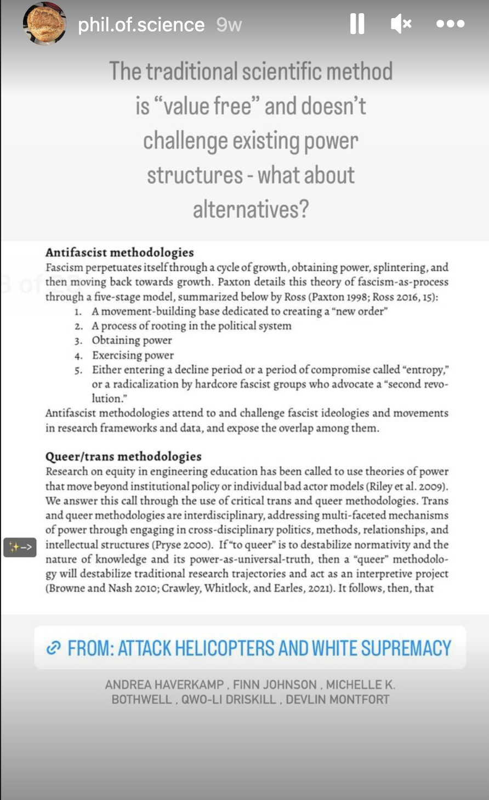

# the propositions or interests of the social & natural sciences

(Wright 2013)

(Vanasupa & Barabino 2021)

(Haverkamp et. al )

#phil-of-science #science #interests #knowledge-constitutive-interests
#methodologies 
__________
Haverkamp, A., Johnson, F., Bothwell, M. K., & Montfort, D. (2023). Attack Helicopters and White Supremacy: Interpreting Malicious Responses to an Online Questionnaire about Transgender Undergraduate Engineering and Computer Science Student Experiences. Northwestern University Libraries. https://doi.org/10.57814/qd1y-9b22

Vanasupa, L., & Barabino, G. (2021). An engineering education of holism: einstein’s imperative. In M. Bouezzeddine (Ed.), Insights into global engineering education after the birth of industry 5.0. IntechOpen. https://doi.org/10.5772/intechopen.99211

Wright, E. O. (2013). Transforming Capitalism through Real Utopias. American Sociological Review, 78(1), 1–25. https://doi.org/10.1177/0003122412468882