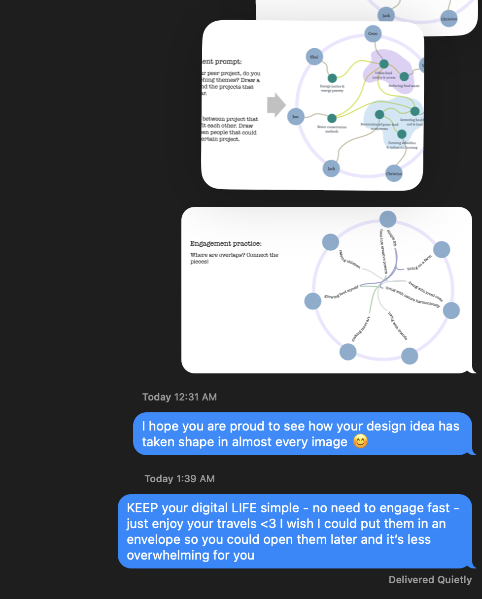

# An app for different forms of communication: letters, short notices etc...

this is more about the structure of communication. It might be helpful to indicate the urgency. For instance, a letter indicated low urgency but high intention. An email with high urgence to respond within two days indicates clear expectations. A random message with no urgence can be left alone for longer. 

also see [[MMSDigitalComA]]

