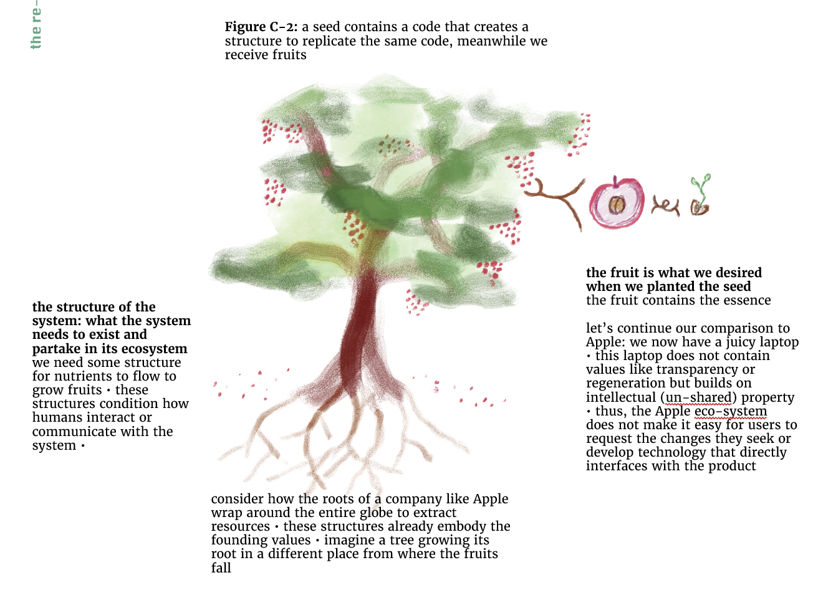

# The essence of our social systems is reproduced in the structures they create
We can think of the newly arising structures as potential fruits. 
We can think of the essence of our social systems as the code or ontological primitives (smallest building blocks of what we consider valuable, reality, purpose, and sacred [[ONTOLOGICAL-PRIMITIVES]])

## self-referential reproduction of social systems
