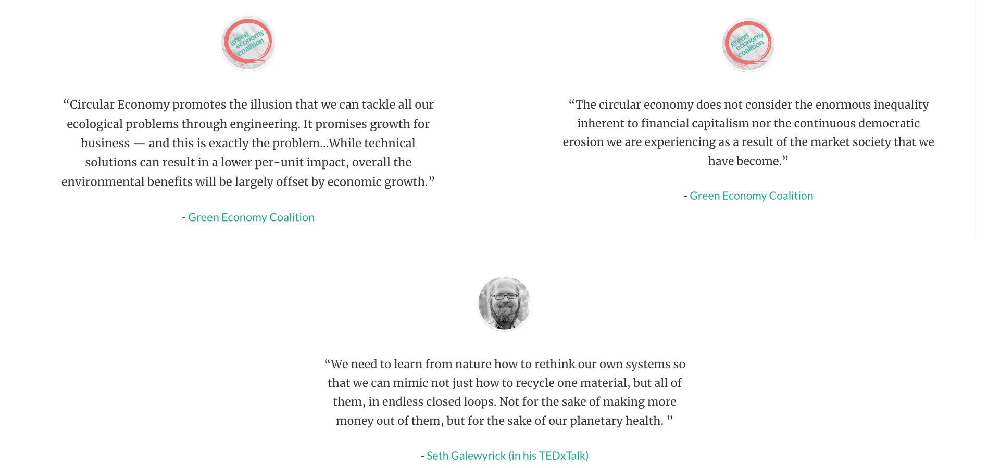

# Why we need to take circular economy frameworks with a grain of salt
What are the problems associated with the traditional circular economy approach? The appraoch seems to portray a solution that lies largely within the space of changing technological processes. However, many argue that deeper systemic and economic changes are needed: 

An article: [Circular economy isn't enough. We need system change](https://www.greeneconomycoalition.org/news-and-resources/circular-economy-isnt-enough-we-need-system-change) [1]

A video: [Learning from Nature - Circular Economies & Biomimicry | Seth Galewyrick | TEDxHieronymusPark](https://www.youtube.com/watch?v=Fidi8Js0Qjs) [2]

________
[1] - https://www.greeneconomycoalition.org/news-and-resources/circular-economy-isnt-enough-we-need-system-change

[2] - https://www.youtube.com/watch?v=Fidi8Js0Qjs