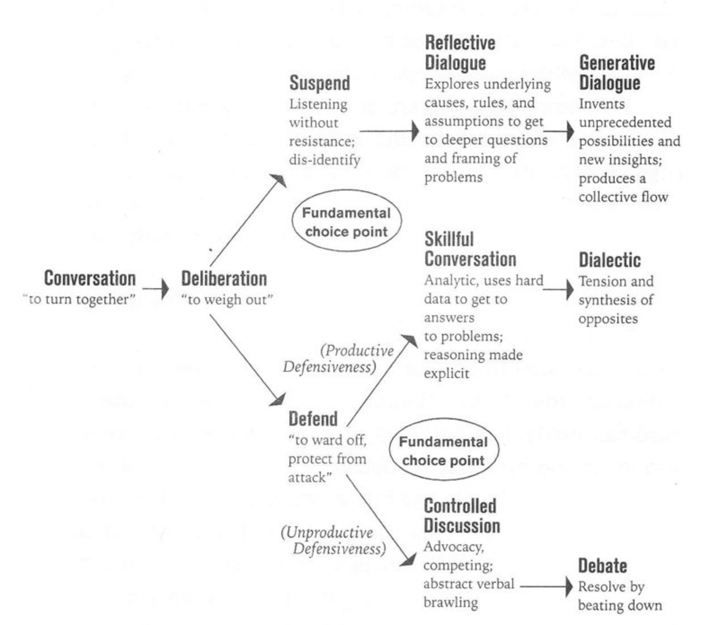

# The difference between a dialogue and a discussion 

One path is one of dis-identification with the truth/knoweldge point in the hopes to gain a deeper insight by living in between the conversation partners. This is called dialogue. Both sides walk together to see more through the senses of each other. 

The other path resembles a hard fight where identiciation with knowledge points is essential (defensiveness/separatness). Defensiveness and hard reasoning may be helpful to define collective truths and paths of reasoning (skillful conversation). If both sides seek to win without the high-level attempt of a dialectic conversation, they identify with a side and seek to defend for the sake of winning (discussion) and/or beating down (debate).

(Isaacs 2008)

________________
REFERENCES

Isaacs, W. (2008). Dialogue: The Art Of Thinking Together.