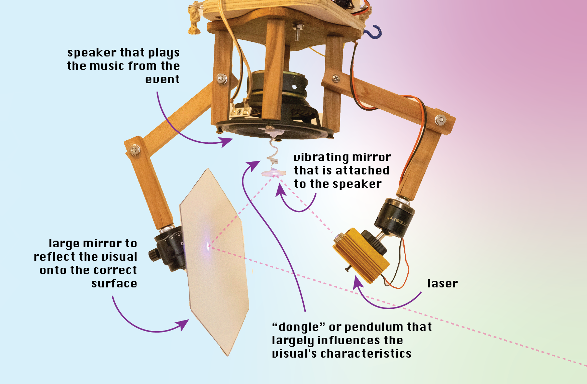
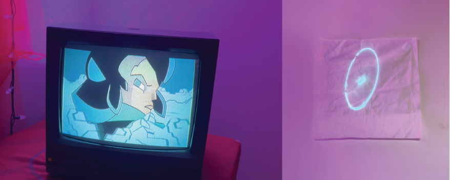
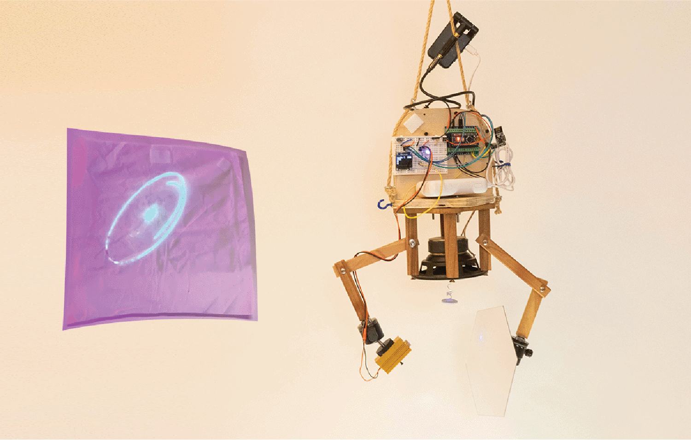
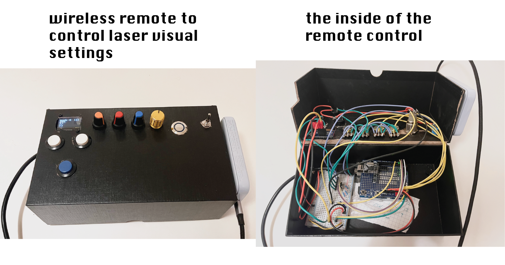
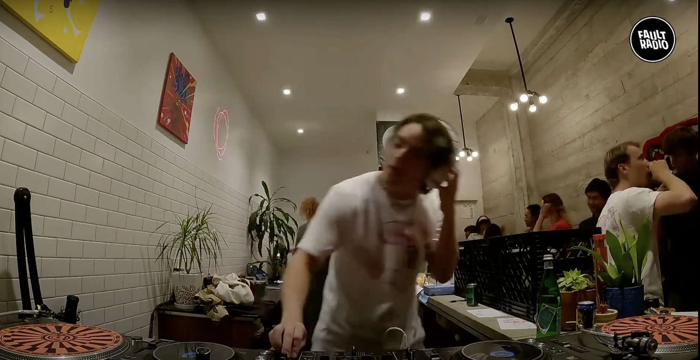
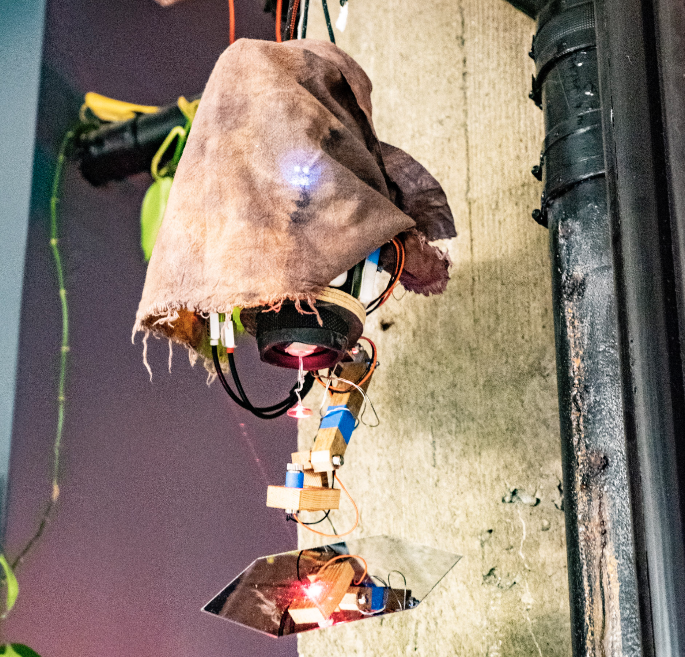

# An overview for my "laser music visualizer"
I have been shaping this laser visualizer on and off for 3 years since its invention night with my friends at a _Make Harvard hackathon_ ([old presentation video here](https://www.youtube.com/watch?v=FHm0N6WwG0I)). This project has continuously pulled me in and excited friends and audiences because the visualization it produces is so distinct and different from  projector- or LED-based visuals commonly installed in clubs & music spaces.  

I enjoy that it is directly synced to the music and represents something real - even something physical (a speaker and virbrating mirror) that is actually moving. I greatly enjoy the patterns it creates and how the visuals are often distinct to a song or baseline. Yet, the general style stays similar throughout the night, creating a pull-in hypnotic effect.

**VIDEOS THAT DOCUMENT A VARIETY OF VISUALS FROM VARIOUS PROTOTYPES**

Even though I mention prototype versions below, every system's visual mostly depends on the dongle design. Refer to the image below to see what the dongle is. 

- video showing the nice patterns & mechanical design & dongle: [watch video here](https://drive.google.com/open?id=10civDd-9JF-H-3Bd6eV9HEJQMKDIcLDG&usp=drive_fs)
- a video of prototype 2 using a violet/UV laser on a glow-in-the-dark canvas: [watch video here](https://drive.google.com/file/d/1l1MZriswP_XaEk1L2y1xKXLuPloSW3ox/view?usp=sharing)
- a video of prototype 1 during a DJ performance, showing a very different characteristic due to a different "donlge" used: [watch YouTube video here](https://www.youtube.com/watch?v=yF6J6Qs61sM)
- nice patterns from and video of prototype 1: [watch video here](https://drive.google.com/open?id=1bYmC6vWL01hWp9DVYv3JUbwNjqFvRZTy&usp=drive_fs)
- more agressive interesting patterns: [watch video here](https://drive.google.com/file/d/1l1MZriswP_XaEk1L2y1xKXLuPloSW3ox/view?usp=sharing)

## The general mechanics-based concept to create visuals

# Events where I installed 

## Night market for the afro-futuristic comic book Quasar
I worked together with Gideon O Egbuchulam to shape the environment of a [dance event and night market](https://www.instagram.com/p/CzT37VSL3ri/?img_index=1) with the purpose to promote his new afro-futuristic comic book Quasar Soliders. The  electronic & mechanical appearnace of the visualizer created a hacky, futuristic sci-fi experience that matched the aesthetic of the comic and animated video playing from an old TV. 

I developed this second prototype to explore the effects of a glow-in-the-dark canvas that is charged up by the UV/purple laser. The effect is not as interesting as expected. The 

### videos of performance of V2
a video of the blue-light laser performing to a song: [watch video here](https://drive.google.com/file/d/1l1MZriswP_XaEk1L2y1xKXLuPloSW3ox/view?usp=sharing)

a video of the laser when bass is low to illustrate that the momvement of the visual largely depends on low frequencesy: [video here](https://drive.google.com/file/d/1kzZRIBprKgb_-05AWdPADXQzIdXBEBcN/view?usp=sharing)

### design of V2: laser & wireless remote control

A big part of this project was the development of a fully wireless system. The visualizer can be controlled via a remote control that I built myself and the music signal is sent wirelessly, making installation and fine-tuning much easier. 

## Skiis DJing at Fault radio with laser visualizer in the background Sept 18 2022
This was a larger event with several DJs, vendors, and artist. In [this YouTube video](https://www.youtube.com/watch?v=yF6J6Qs61sM), Skiis DJs with the laser in the background. **The laser's movement in [this video](https://www.youtube.com/watch?v=yF6J6Qs61sM) is particularly fun because it bounces around quite dynamically**. I received enthusiam from a few people as they had never seen a visualizer that didn't use a projector or screen before. 

The laser I used at this event was my first legit prototype (V1) and looked as follows:

## Media archive

- folder with all images and videos besides youtube videos https://drive.google.com/drive/folders/1tR-mtjFpGnDntmnmfJzJfZR_EcrjVrzx?usp=sharing
- timelapse of hackathon https://www.youtube.com/watch?v=MxvMdnYlsK0
- presentation of 

