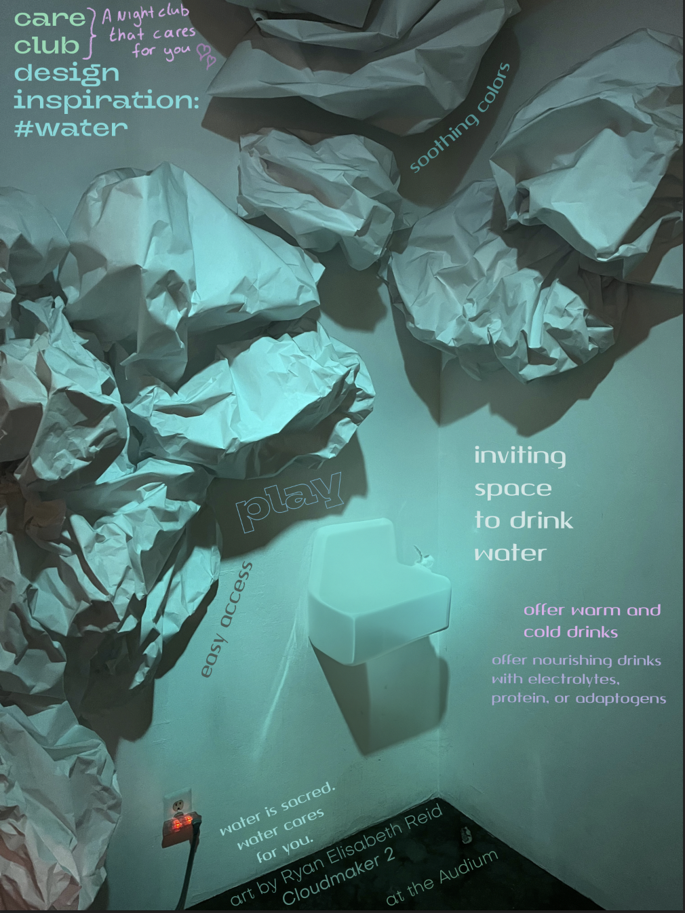
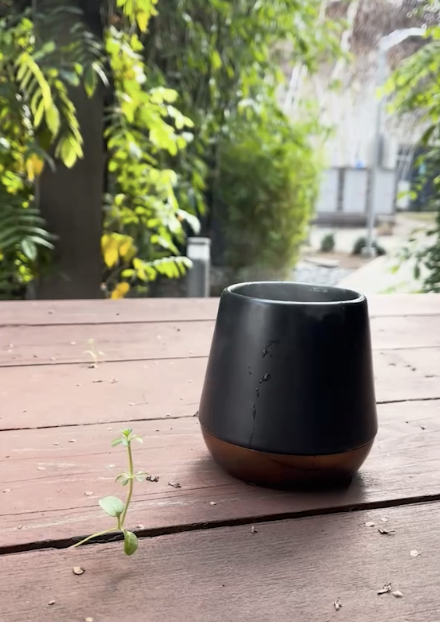

# A list of nourishing drinks for dancing
#careClub #inspiration
I desire nourishing drinks during a long night of dancing. 

## tea to soothe my stomach & soul
   - adaptogen teas
   - resotring mucus teas
   - digestion teas

## water with flavorless electrolites (ADD: lemon)
- alcohol free coktails with adaptogens for energy & resilience (NO: refined sugar)

## protein rich
- smoothies with hemp or pea protein 

## shot and spicy
- shot for strong flavors with spice, sweet, tangy:
    - tumeric orange shot with black pepper

## From friends:

**Dana:** Seasonal herbal lemonade and other herbal elixirs, boba tea, decadent hot chocolate, fresh spring water.

**Whitney:** rose milk

**Mulu:** lavender milk

**Jules:** electrolytes for energy, hydration, and connection. like fuel for a fire --> building social neuro-pathways

