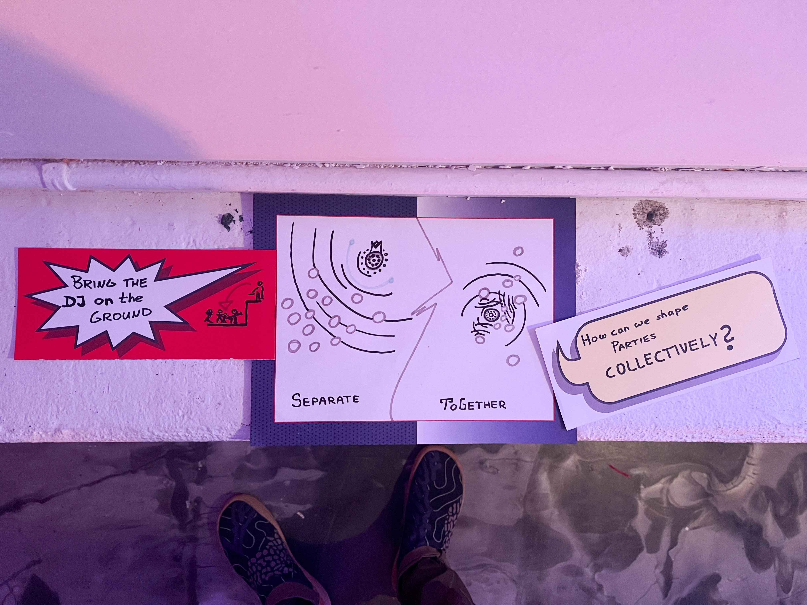
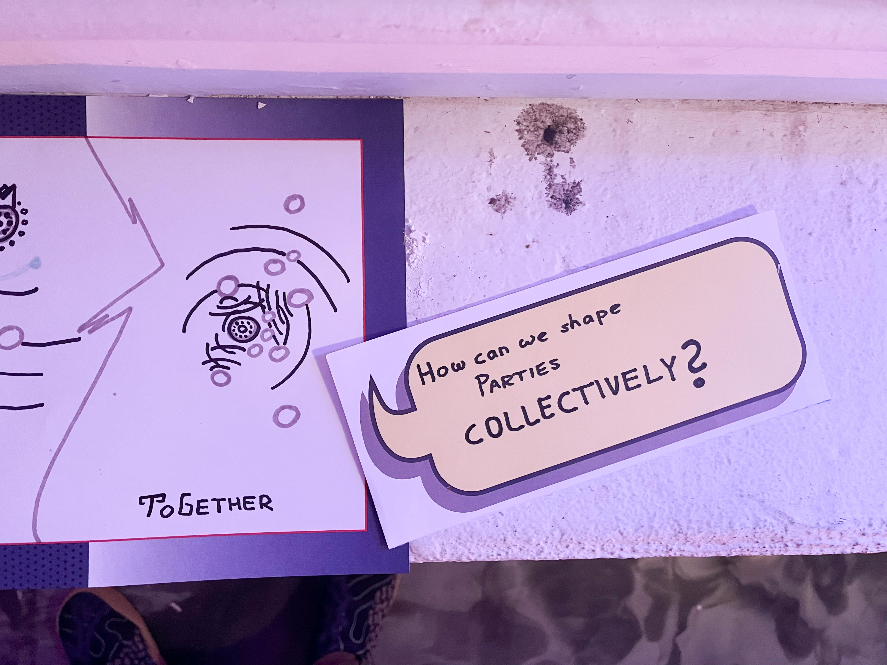
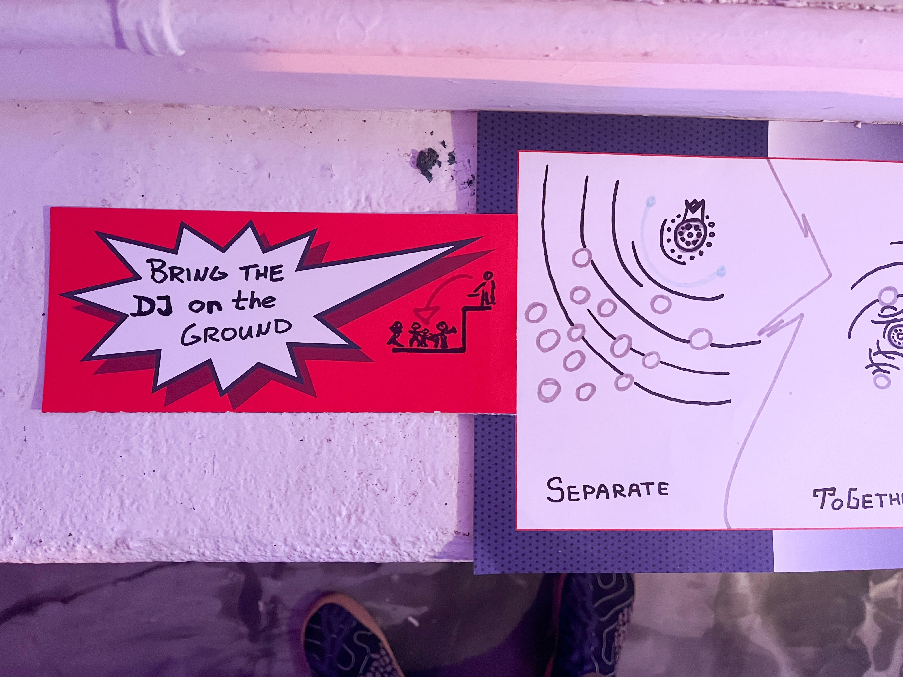
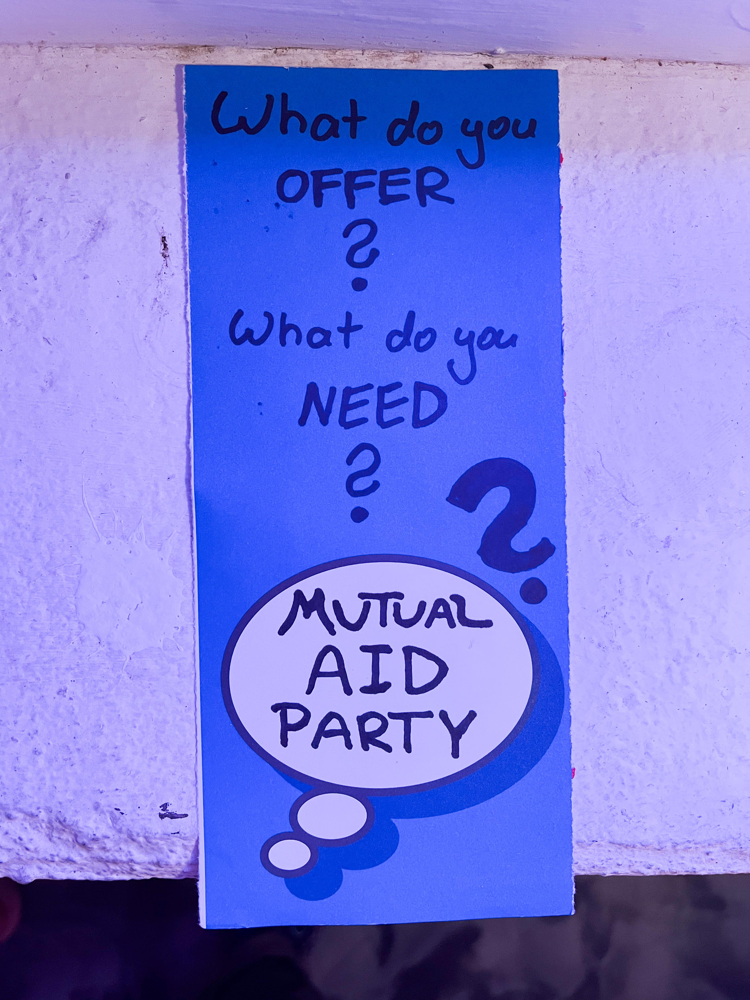
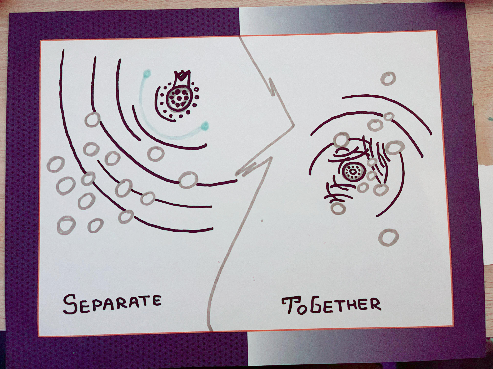

# Ideation around partying together and separately 

On December 2n 2023:

Last week, because of a fun art corner at this fashion show & party, I naturally devoted some time to visually exploring the difference between hierachical and low-hierarchy partying-together. 
In most club settings, the DJ is lifted above the crowd. No invitation to engage - by design. But I am really curious about what could emerge from bringing the DJ or DJs to the middle of the room and allow for deliberate interaction. 
I will always remember those parties as the most fulfilling where the music and dance energy arose from the contributions of all my friends around me. 

