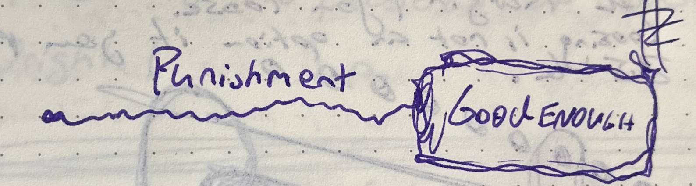

# VISUAL: Grades are a sad mix of rejection and merely good enough

Having a GPA that reflects "good = B" or "very good = A" is nothing special nor does it exceed expecatations. Such GPA are the bare minimum for acceptance. 

