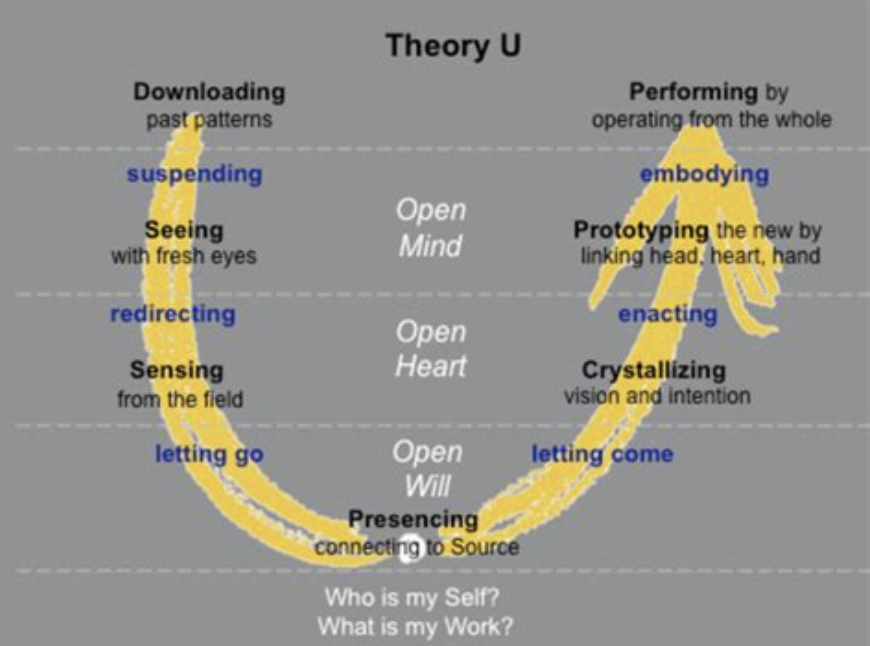

# Immersion into the unknown & imagination
Here, something comes to my mind that goes beyond imagination. It is the ability to immerse ourselves in new situations to experience new realities and understand how things can shift. Imagination, of course, increases when we do this a lot. Immersing ourselves in the unknown is scary but quite essential. This relates to Otto Scharmers change management theory and integrates well with radical imagination. 

So i argue that we need more than just imagination. We need the practice of imagining and immersing ourselves in the unimaginable to tune into what can be imagined. Understanding what can be imagined is a way of understanding reality (McGilchrist 2021). And we tune into what can be imagined by immersing ourselves in various forms of reality including those forms that are unkown to us.

Whenever we seek to bring about change, we need to make a first step into a new world (Otto Scharmer & Katrin Kaufer). 

__________
McGilchrist, I. (2021). The Matter With Things: Our Brains, Our Delusions, and the Unmaking of the World (p. 1500). Perspectiva.

Scharmer, O., & Kaeufer, K. (2013). Leading from the Emerging Future: From Ego-System to Eco-System Economies (1st ed., p. 304). Berrett-Koehler Publishers.

