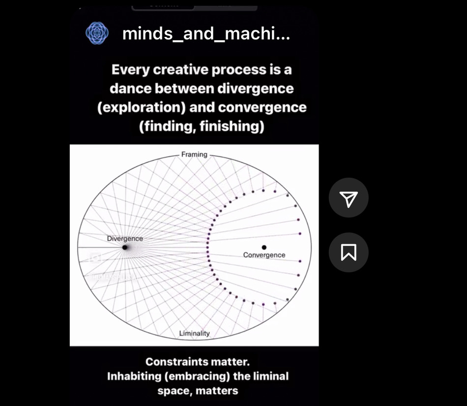

# intelligence is compression

i need to look up if the processing of large amounts of sensory input is what interroception refers to 

the spotify data presenter on my flight neighbor's phone says this. (earlier he also said that everything is a vector, anyway) I immediately think about how I say in my [[MESH-EJ-THESIS-V1]] that we can tune into a deeper intelligence by connection to more aspects of our lives (emotions, stories, lived experiences etc). but at the same time we also create much more to work with. so we need to compress what we learn. In a way, we need to learn how to "work with ourselves" which is the action that arises out of the compression. i keep coming back to learning how [[WORKING-WITH-SELF]]

#divergence #convergence #compression

we try to simplify because fully seeing and feeling reality is 