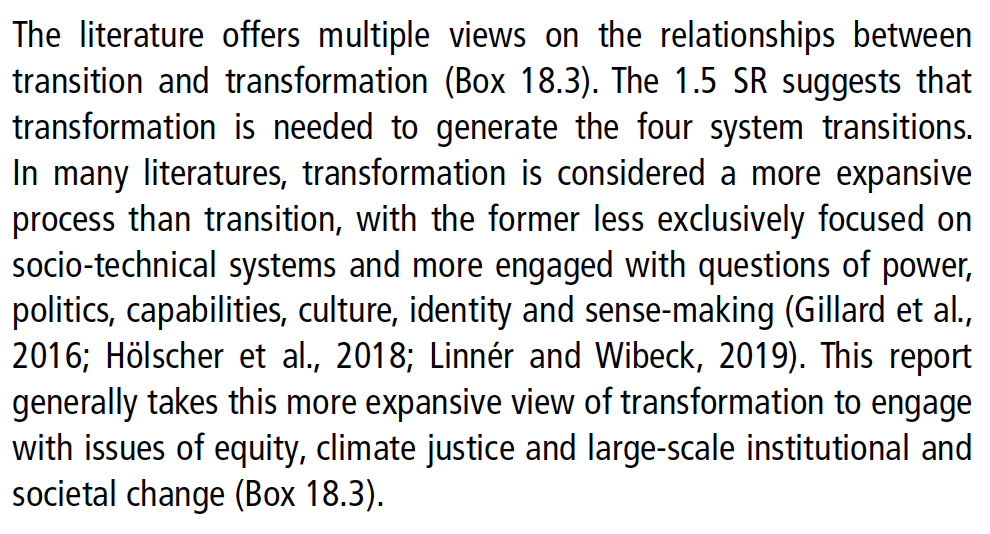

# IPCC AR6 sees transition needs in 5 realms
- energy
- land
- urban and infrastructure
- industrial systems
- social systems
(IPCC p.172)
#transition #IPCC #report 

--> the need to transition in the social realm includes the social work of *self-transformation* to see that we are all one [[MESH-EJ-THESIS]](section C-10; ideas from Shai Tubali on self-tranformation)

## transformation definition
"Transformation is defined as ‘a change in the fundamental attributes of a system including altered goals or values’ (SR 1.5). The related concept of transition is defined as ‘the process of changing from one state or condition to another in a given period of time’ (IPCC SR 1.5/SRCCL; also see Section 1.5.2)." (IPCC p. 171)

## relationship between transition and transformation (IPCC)

Sources
IPCC https://report.ipcc.ch/ar6/wg2/IPCC_AR6_WGII_FullReport.pdf