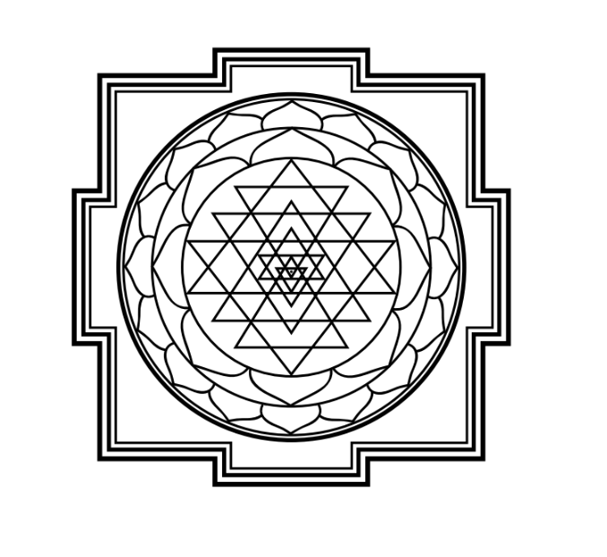

Observe the sri yantra, a powerful meditation tool, considered to be the mother of all mandalas. There are 54 points in the sacred symbol where lines intersect, and each intersection is also said to have a dual energy of masculine and feminine, bringing us once again to 108. At the centre of the sri yantra is a bindu — a point that symbolizes the source of creative manifestation.

