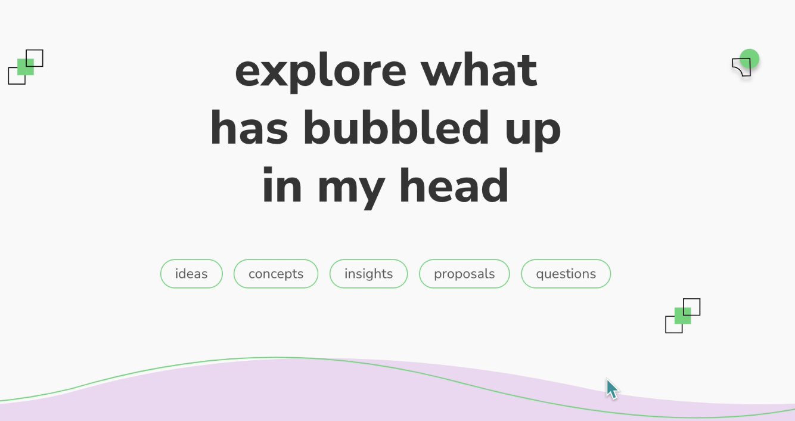

# IDEA: create a market space to network, surface insights & proposals, and interconnect movement efforts via collaboration 

I see a demand for a networking tool that does not purely rely on emotional labor of one-on-one socializing. I see an opportunity to use a physical space (room, wall space, and physical props) to naturally elicit an in-peron & asynchronous networking mingling centered around written text, mapping, and personal interaction. 

This market could allow people to find answers to the following question:

**who else wants to connect over these shared interests?**
- "I came here to connect with people who are interested in these *topics.*"
- "contact me via this *phone number* through the conference to meet up"

**how may we support each other?**
- what are *offers/services* from orgs or individuals?
- what are particular *needs* of orgs or individuals?

**how may we learn together?**
- what are*questions* that emerged from the talks/conference?
- what are core *insights/concepts* that emerged from the conference?
- what are project *ideas/proposals* that surfaced during the event?
- what are *unmet needs* that became clear during the event?
- how could the conference could do better?

the list above is inspired by my design prototype concept with which I seek to share a variety of "bubbles" in the fields of ideas, insights, project proposals with my friends. 

## Concrete ideas: what forms of wall space or room space could we create?
Below is a collection of space design concepts to enable the asynchronous (not necessarily in person) communication about needs to connect. 

This is essentially a deeper split-up of a "needs" section. I am unsure if this division is necessary. It might help to streamline communication as some orgs or people are interested in very specific forms of collaboration or work. 

### "You may reach out to me when you or your org is interested in talking or building movement in the spaces of..."
The focus of this space would be to get to know each other and connect over shared interests or movement building efforts. This space could be created by seting up wall space where people can introduce themselves on large sticky notes with their interests or asks/needs and offers. They may add phone numbers or other ways to contact them throughout the conference. (little idea on top: option to pay for a quick printout of their face could be added)

### "Seeking collaborators in ..."
This space is slightly different from movement building as it focuses on concrete collaborations. For instance, someone may have the need for a software programmer or a visual artist to collaborate on an already existing project. 

### "This is who we are, and we need these nutrients"
This visualization would be more focused on summarizing the identity of a whole org or person. An entity can put up their name and add a sticky note for every nutrient/need they have. This could also be accompanied by a section for offers. 

## Concepts embedded in this market practice

### buildings relationships beyond emotion-intensive one-on-one networking

### synthesis of collective wisdom, struggle, urges etc - like Chat GPT
What would a neural network know that had only been trained on the insights and contents from the conference? What would be the concepts that could be synthesized from the event? What questions do people go home with?

__________
#conference #idea #faciliation #retreat 
__________