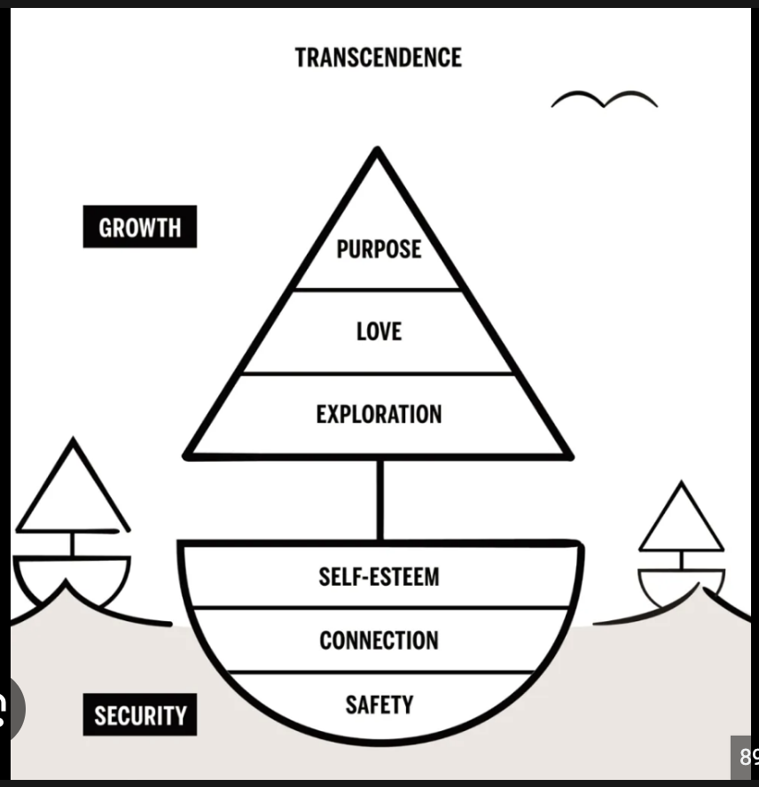
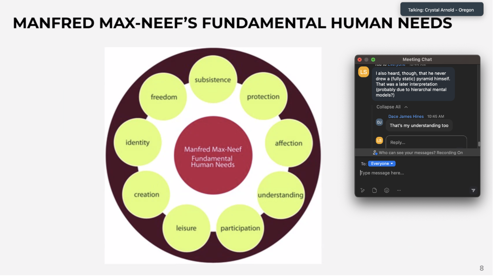

# classic Maslow model: pyramid of needs
was appropriated from indigenous communities (Ravilochan 2021).

And his group of research to develop his concept was comprised mostly of white men and only one woman (OANM faciliation training). 

# more dynamic needs models 
Native self-actualization model: https://www.youtube.com/watch?v=ONTAefdVs5o

Scott Berry Kaufmann 

Manfred Max-Neef's fundamental human needs

________
What Maslow Missed in his Hierarchy of Needs - The Native Self Actualization Model: An Interview... - YouTube. (n.d.). Retrieved September 19, 2023, from https://www.youtube.com/watch?si=w8RpmQw7mYKtDfPb&v=ONTAefdVs5o&feature=youtu.be&themeRefresh=1

Kaufman, S. B. (2020). Transcend: The New Science of Self-Actualization (Illustrated, p. 432). TarcherPerigee.

Ravilochan, T. (2021). The Blackfoot Wisdom that Inspired Maslow’s Hierarchy - resilience. Retrieved September 19, 2023, from https://www.resilience.org/stories/2021-06-18/the-blackfoot-wisdom-that-inspired-maslows-hierarchy/

Salzberg, S., & Kaufman, S. B. (2022, January 10). Ep. 174 – Scott Barry Kaufman, PhD - Metta Hour with Sharon Salzberg Podcast. Spotify. https://open.spotify.com/episode/59fLG4LegMQpa7LMQ4CyDf?si=6df28a9121cd407b&nd=1

