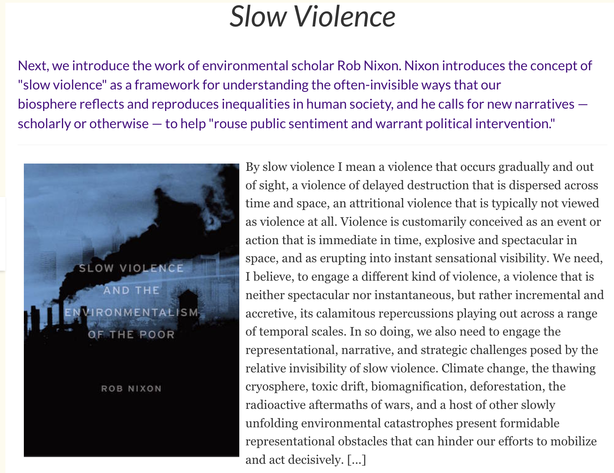

# Surfacing slow violence within the container is important for collective liberation and (self-)awareness
This question stood out to me: "how can we convert into image and narrative the disasters that are slow moving and long in the making [...]?"

with respect to my research interest, what comes to mind is the emotional neglect and suffering of those who seek to learn and create change (AKA us). I find it very curious how there is slow violence against students in pretty much all institutions. It's against their sleep, their mental health, their future potential to become strong, autonomous beings. [I am unsure if I want to focus on this negative view in my capstone, but I am intrigued to surface the reality of life within the educational container to strengthen human connection]

