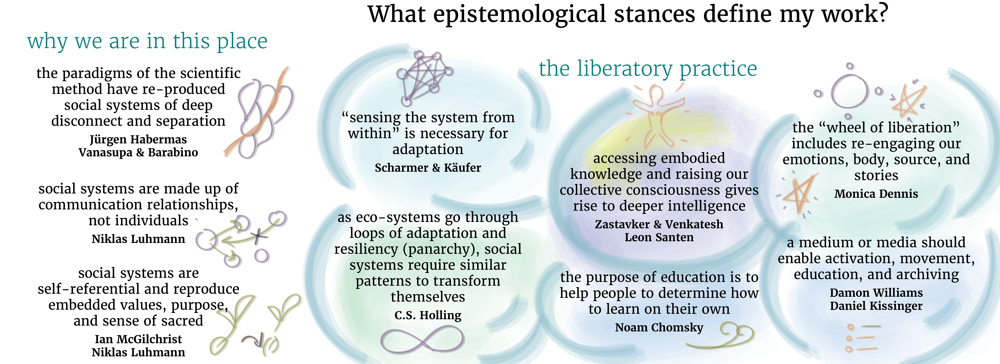

# Empistemological bubbles of my capstone project

**Bubbles to add:**

- the personal is political (can be found in my spirit thesis)

________
## References

Chomsky, N. (2012). The Purpose of Education. https://youtu.be/DdNAUJWJN08?si=YPgeCI45Jwz-mPtn&t=27

Habermas, J. (1972). Knowledge & Human Interests (2nd Printing October 1972, p. 368). Beacon Press.

Holling, C. S. (2001). Understanding the Complexity of Economic, Ecological, and Social Systems. Ecosystems, 4(5), 390–405. https://doi.org/10.1007/s10021-001-0101-5

Luhmann, N., Schmidt, J. F. K., & Kieserling, A. (2017). Systemtheorie der Gesellschaft (Erste Auflage.). Suhrkamp.

McGilchrist, I. (2021). The Matter With Things: Our Brains, Our Delusions, and the Unmaking of the World (p. 1500). Perspectiva. Monica Dennis. The wheel of oppression and liberation

Santen, L. (2023). How can we transform ourselves? (Spirituality & Ecological Justice). Final Paper for Environmental Justice Class (MESH). https://leonsanten.info/contemplatingChangeForEJ.html

Scharmer, O., & Kaeufer, K. (2013). Leading from the Emerging Future: From Ego-System to Eco-System Economies (1st ed., p. 304). Berrett-Koehler Publishers.

Vanasupa, L., & Barabino, G. (2021). An engineering education of holism: einstein’s imperative. In M. Bouezzeddine (Ed.), Insights into global engineering education after the birth of industry 5.0. IntechOpen. https://doi.org/10.5772/intechopen.99211

Williams D., Kissinger D. (2023). https://github.com/LSanten/MMS-Bubbles/blob/main/Zettelkasten/MEDIA-MOVEMENT-BUILDING-A.md Chomsky, N. (2012). The Purpose of Education. https://youtu.be/DdNAUJWJN08?si=YPgeCI45Jwz-mPtn&t=27