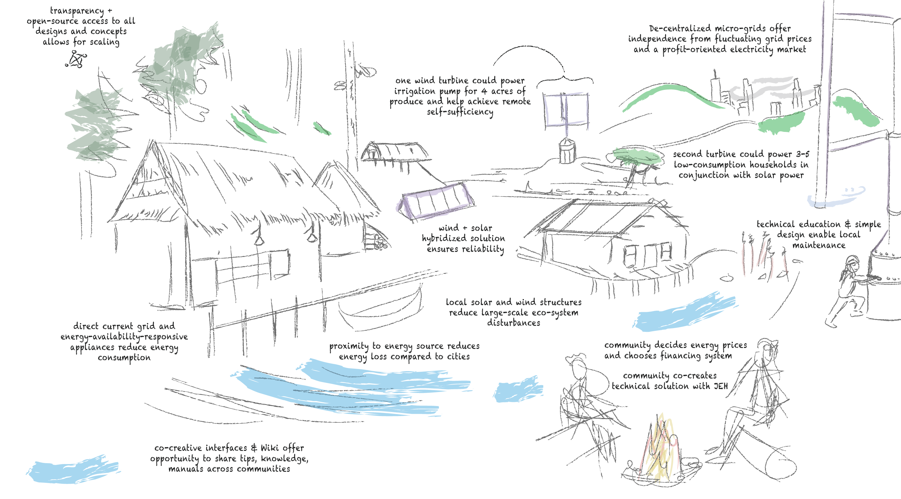

# What is a microgrid?

## A schematic for a small off-the-grid solar + hydro system

[1] - a microgrid with two solar panel arrays and a microhydro generator (very small water turbine). The "arduino control unit" can be ignored. It was an additional add-on to monitor the battery voltage to prevent battery health decay. 

## Energy sovereignty & energy democracy

how to work with community:

[https://journals.sagepub.com/doi/10.1177/0020872819887786](Working together to reduce energy poverty in Timor-Leste with environmentally sustainable community-based economic development: A transnational developmental social work approach)

## Aspects of energy sovereignty projects...
I created this graphic to illustrate the variety of dimensions that are crucial when working with communities to realize their **energy sovereignty**. 

staying warm --> Heaters require a lot of energy. It tends to be better to use gas or oil for heaters unless you have a large system. 

battery backup systems --> [https://peoplepowersolar.mn.co/posts/45812190?notification_id=3955803747&origin_method=email&utm_campaign=notification_space_post_create_notify_all&utm_medium=email&utm_source=transactional_emails](Emergency Battery Toolkit Release Party)

wind energy --> (https://www.primoenergy.com/)[PrimoEnergy], 

micro-hydro --> small things for rivers --> (https://www.popsci.com/gear/best-hydroelectric-generators/)[small turbines, the left one you can put into a stream
]

________
REFERENCES

[1] - http://wiki.olinatwoodlandharvest.com/index.php/Main_House_Electricity_System
