## Climate Collateral Webinar

### **[Climate Crossfire: How NATO’s 2% military spending targets contribute to climate breakdown](https://www.tni.org/en/publication/climate-crossfire)**

- at least 5.5% of all GHG emissions are emitted by global military (not including conflict emissions)
- world-wide military spendings increased 21% since 2013
- the military is used increasingly to *push away* climate migrants and social uprisings due to climate injustice (also see Slide on Arms exports from wealthy countries to climate vulnerable countries)

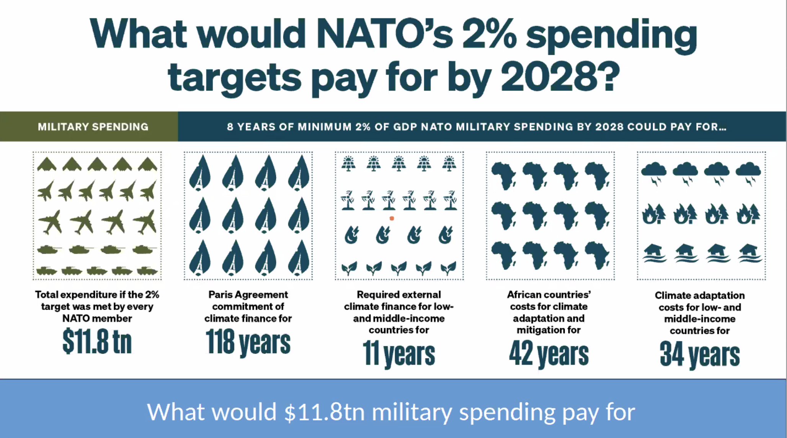

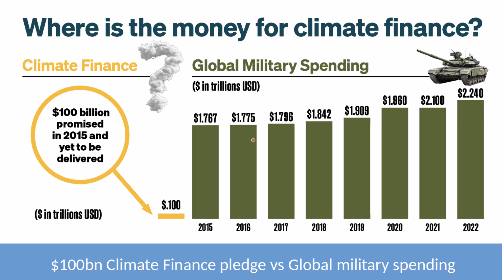

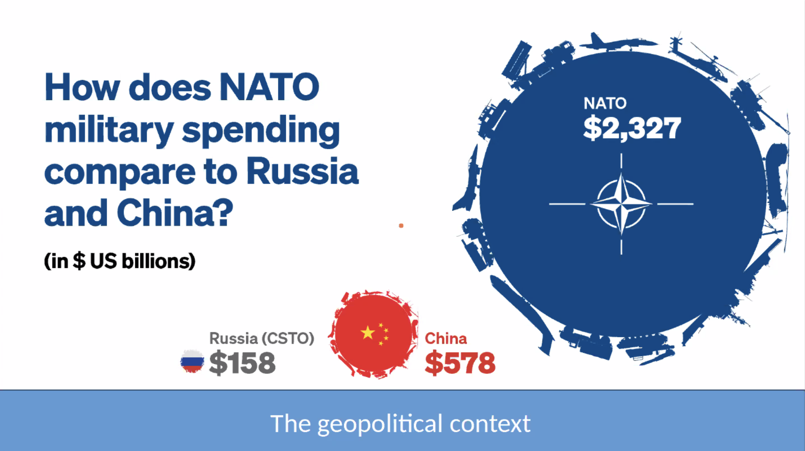

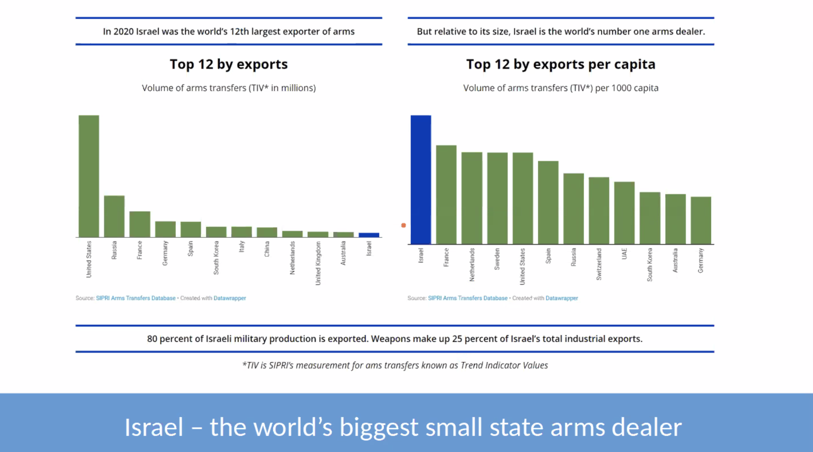

Relative to Israel's size, it is the largest arms dealer. Spends 24 bln dollar / a year on military. The US department of Defense is the second largest employer world-wide, and per capita, it is more than 4x larger than the Indian defence department (which is the largest employer world-wide) [[MILIT-A]].

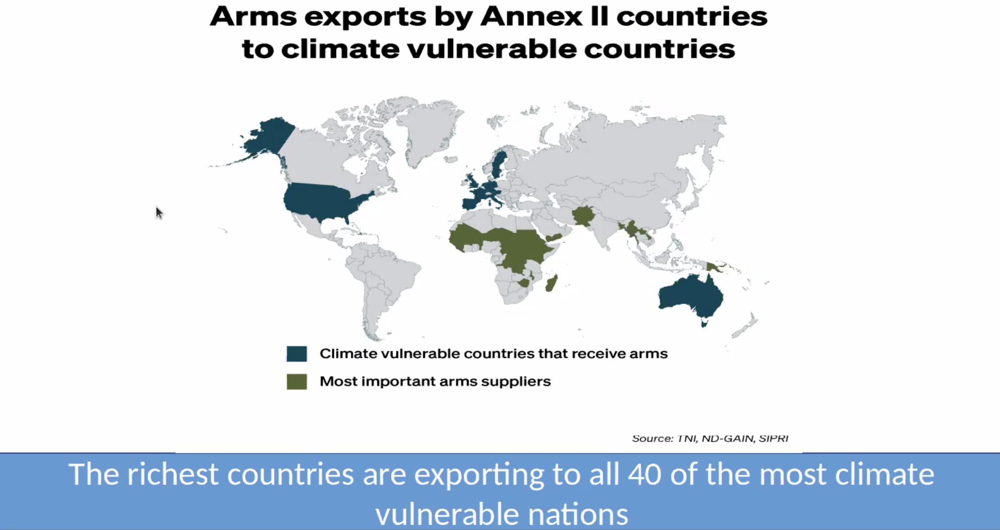
climate change is being talked about as a "security threat" to national security. Threat to operations of the military (sea bases), or poor countries becoming a threat to rich countries due to conflict and migration - so migration needs to be controlled. 

ANNOTATION: colors above should be flipped.

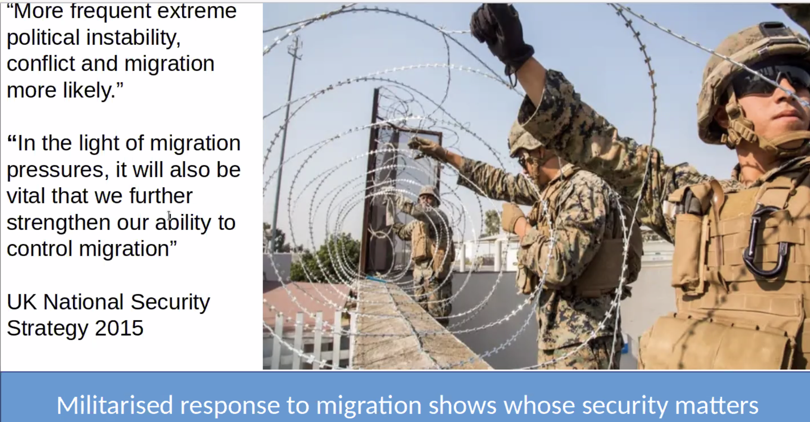

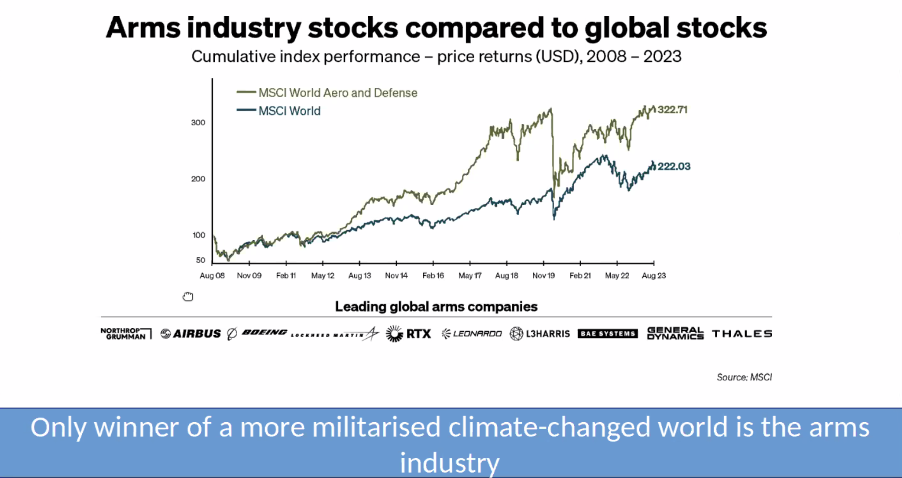

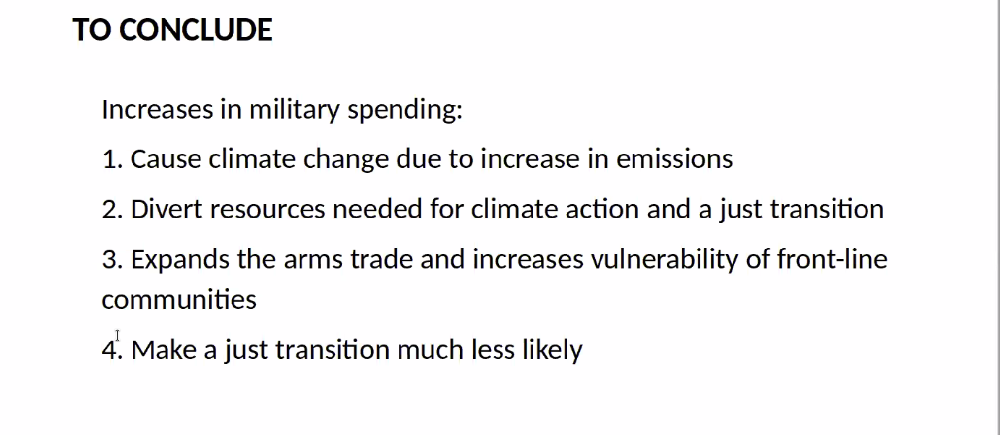

### **[Less War, Less Warming: A Reparative Approach to US and UK Military Ecological Damages](https://www.common-wealth.org/publications/less-war-less-warming-a-reparative-approach-to-us-and-uk-military-ecological-damages)**

US soldier now consumes around 20 gallons a day 
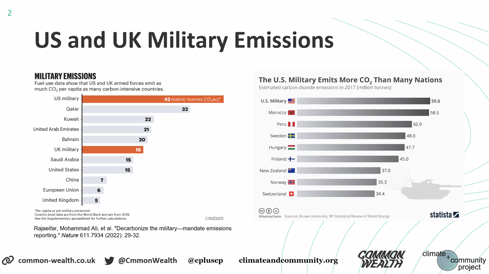

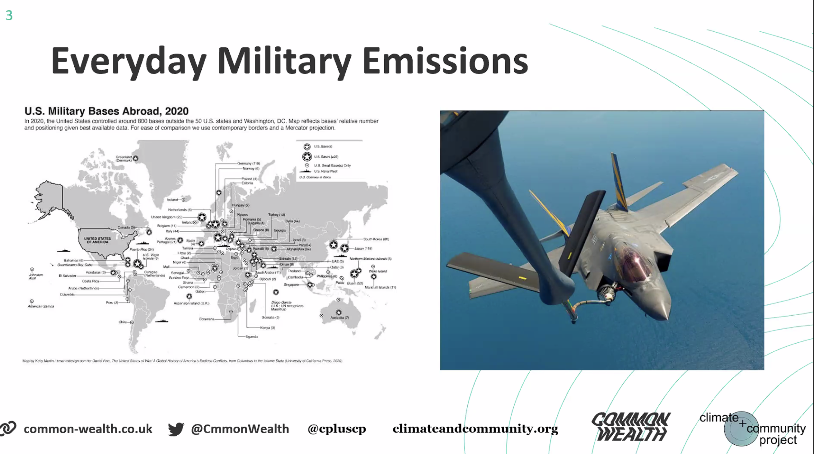

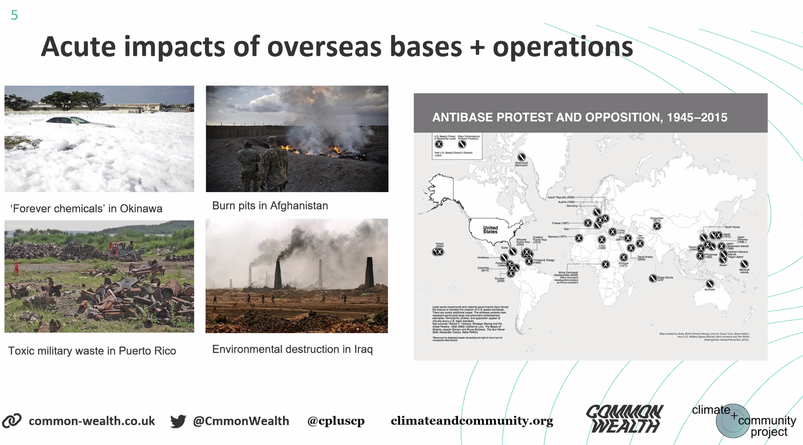

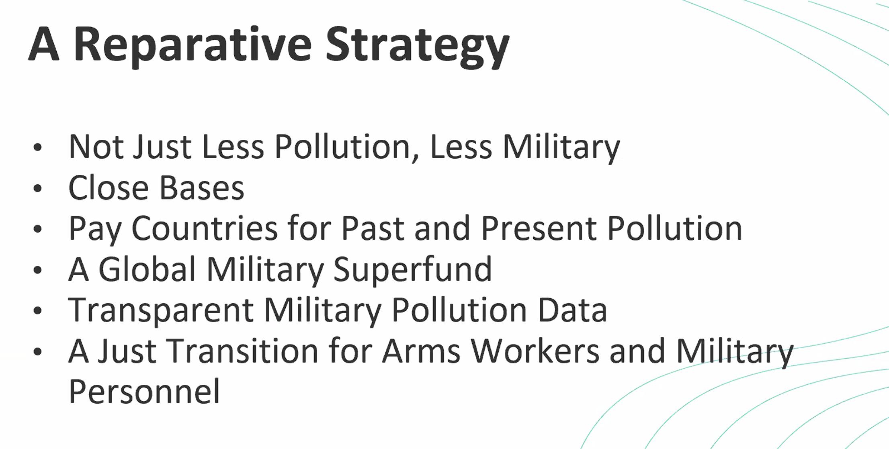

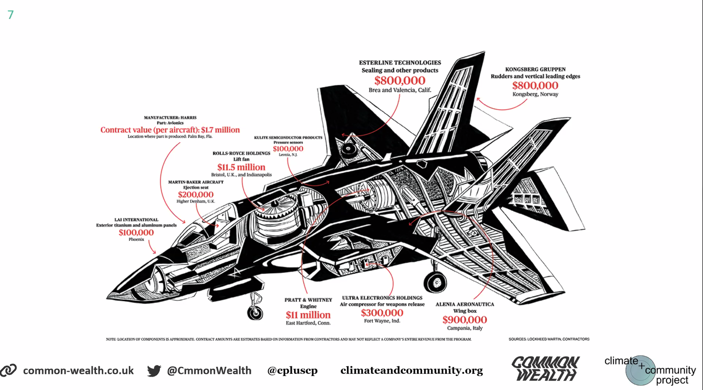

using military to compensate for the lack of social structure by sourcing from all over the world/US. 

you can't just have a green military. 

### **Mitzi Joelle Tan** 

Palestine is a climate justice issue. The people who are exposed to war and violence are more vulnerable to climate change. Herrassment of communities by the military due to climate tensions. 

--> Climate justice is really just the **the fight for life**. To decide for life is the human right. 

### other resources
- **[Climate Collateral
How military spending accelerates climate breakdown](https://www.tni.org/en/publication/climate-collateral)**
- [No, Arms Dealers Don’t Count as “Environmentally and Socially Responsible” Investments](https://jacobin.com/2023/06/arms-dealers-environment-social-responsibility-investments-green-warfare-security)
- [AN URGENT CALL FROM PALESTINIAN TRADE UNIONS: END ALL COMPLICITY, STOP ARMING ISRAEL](https://www.workersinpalestine.org/the-calls-languages/english)
- [another great report on arms workers perspective on a just transition](https://www.thebritishacademy.ac.uk/documents/4197/Just-transitions-decarbonising-diversifying-defence-uk-usa.pdf)
- [Revealed: How colonial rule radically shifts historical responsibility for climate change](https://www.carbonbrief.org/revealed-how-colonial-rule-radically-shifts-historical-responsibility-for-climate-change/?_hsmi=284302147&_hsenc=p2ANqtz-9Sue_r9RXENt4WeOAiPxdZzgz95ehD_ANlyTZS318UeVFS1MIioSA7D_Kn8RfGmpr761qGXr6mN1zB5_7HZNr1j1QkdS99hEvHZ_s7NZ7pe4BrQHk)