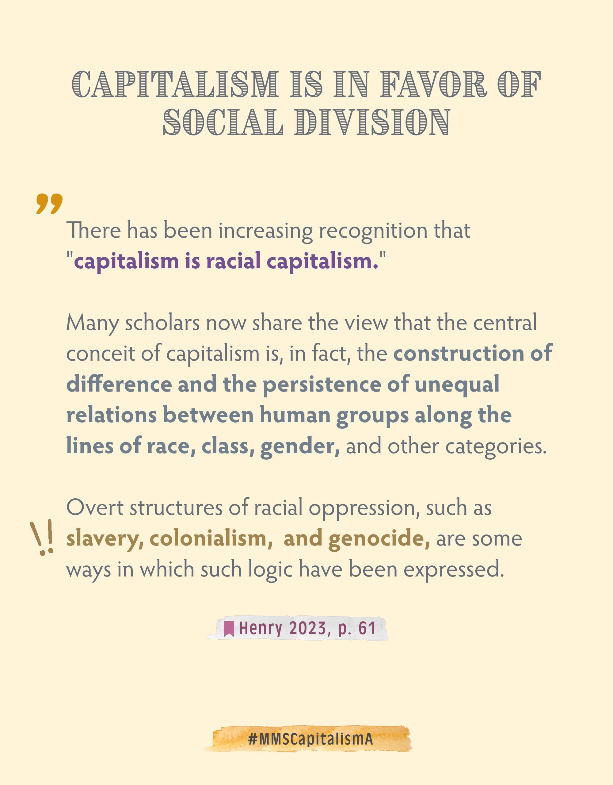
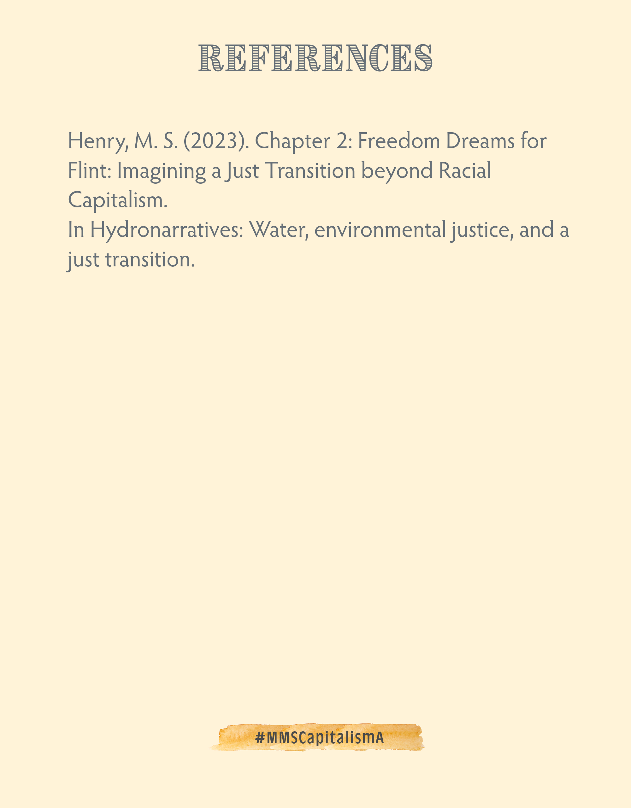

# Difference and division are core-components of capitalist thriving 

## Introduction to capitalism 
"Capitalism is an economic system in which  employers, using privately owned capital, hire wage labor to produce commodities for the purpose of making a profit" (Andersson & Eriksson 2010, p.125)

More in-depth info you can find in the section [[OVERVIEW-CAPITALISM]].

## three things work together: profit-driven capitalism, statusdriven consumerism and power-driven international competition
"The three mechanisms described above are interlinked and feed on each other. In  order to get rich and strong a country needs to develop its economy in cooperation  with national and international investors/capitalists. Capitalists look for states that  are growth-oriented and provide the best workers and markets. Career- and   consumption-oriented individuals again prefer  fi  rms and states that are economically successful" (Andersson & Eriksson 2010, p.125).

________
REFERENCES

Andersson, J. O., & Eriksson, R. (2010). Chapter 9 “Growth and Degrowth - Is Another Economy Possible? In Elements of Ecological Economics (1st ed., p. 176). Taylor & Francis.

Henry, M. S. (2023). Chapter 2: Freedom Dreams for Flint: Imagining a Just Transition beyond Racial Capitalism. In Hydronarratives: Water, environmental justice, and a just transition.

