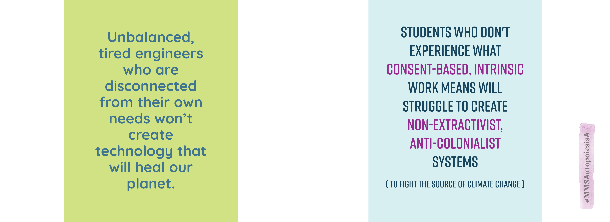
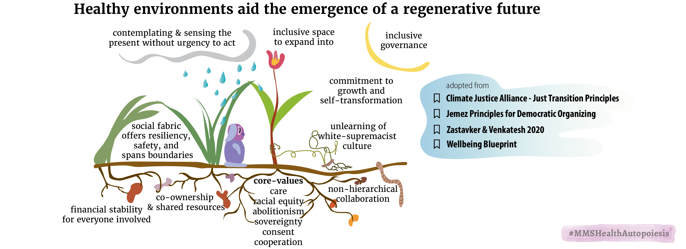
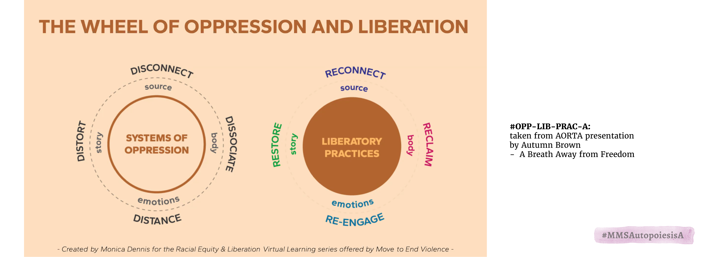

# The system's capacity to be conducive to health is re-created in the systems that emerge from it  

## therefore, only people (or systems) who live balanced themselves, can truly do the work to balance our social-ecological systems

comments from my friends:
Soon Il: "Yeah i think both quotes resonated with me-in particular the first quote about how engineers disconnected from their own needs won’t produce technologies that can heal the planet -i was reminded of my undergrad engineering experience and how disconnected i felt from myself during that time. I felt that the culture in engineering felt very much colder and very separate from oneself, or that may have been just my experience in engineering at the least"

