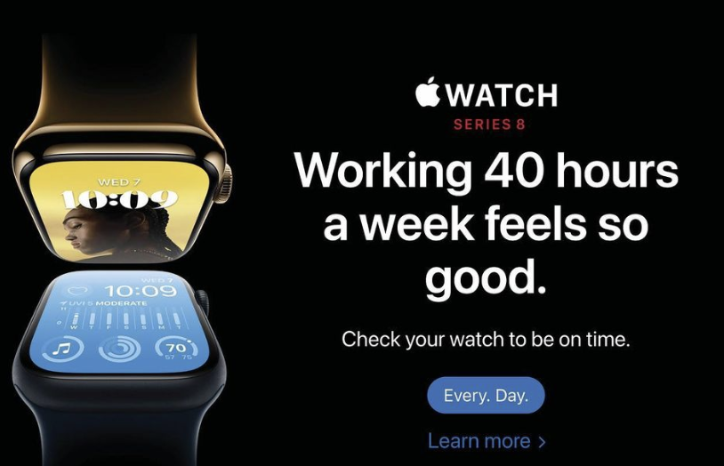

# A proposal to change communication around and interface design for battery health

I am observing the trend that the producers of tech products tell us very little about the maintenance needs that their products require. This exploration focuses on battery health because users can influence the helath of their devices the most by taking care of the device's battery. Furthermore, it is becoming well-known that lithium ion batteries are full of toxins and require large amounts of resource extraction. For these reasons, I chose to focus on exploring the potential of shifting toward a culture of talking about care-taking and health of our products. 

On a meta-level, it seems quite obvious to me that health is a generally unvalued topic. While this design exploration concerns the health of devices, I reason that the void of talking about *how to care of our technological devices* stems from the absence of understanding how to practice care-taking and health-oriented cooperation in this current world. 

## General project & illustration idea
I currenlty draw excitement from an internal vision to illustrate how a well-known company like Apple could talk to their users about maintenance of their devices, in particular their batteries. 

🫧 **Illustration of pop ups in Apple font**: I imagine pop ups on phones and laptops that inform the user in clear and beautiful graphics that they have the ability to influence the health of their device. 

🫧 **User interface desing concept to control battery parameters**: I imagine a different user interface that gives autonomy to the user to decide how to use their battery. This would allow users to keep the battery at a certain charge to minimize battery cycles instead of always fully charging it. Here, I have brainstormed a whole array of battery maintenance features that could be helpful to take care of the device (see FEATURES).

#proposal #idea

## How to bring the message across: 

**Narrative**: As far as I understand, it is bad for batteries to charge and discharge them constantly. Why does apple now allows users to keep the battery at a working charge of 50%? Why does apple not help users to mangage the battery health of their devices? From my perspective, as a _caring_ engineering community, we should be concerend with communication about maintenance. 

🫧 **Aesthetics - fonts, style, using familiar visual language**:

For instance, we could create an advertisement that reads: 
"We at Apple care about the longevity of our products their impact on our planet. For that reason, we are all working together to keep the health of our products as high as possible"

In the past, I have played around with appropriating fonts and branding to strenthing the message. I similarly plan to use a sleek font on known user interface to convey how differently producers of products could communicate with the user. Below are examples of satirical illustrations that I created by modifying apple's web page. 

## FEATURES - how I would change the battery maintenance interface
These features give the autonomy back to the user to use the battery to serve their purpose and protect it from unnecessary charging if not needed.

**allow users to choose between**: 
- charge as fast as possible ("I need to leave soon")
- keep at a specific percentage best for battery health around half-charged ("I need to work from home for a few days")
- charge my battery as slowly/healthily as possible within certain time frame ("I need to leave tomorrow morning with a full charge")

- do not make this decision for the user when to charge the battery full all the way
- do not always charge as fast as possible - let the user choose - #autonomy #care
- have a setting to enable reminder to charge slightly below 50%
- setting to automatically shut down device so it rests at night

                                                       

## base ideas 

*health*: the priority of working together is to ensure that we all are healthy & well. So it matters that we talk to each other how we can contriubte to each other's health. Sadly, this is not the case in many parts of our society. One striking emergence of this not-caring about health is the fact **no company tells us how to take care of their products**. 

## Evidence
Microsoft shares about 650 words on battery health [1]. This is decent but short if we consider that the user has the hightest ability to influence the laptop's health via battery care. 

Apple [2], similar to Mircrosoft, emphasize that it's important to keep the battery healthy but do not give the user any option to control the cycles themselves. 
**They provide plenty of options for reducing the energy usage of the product (brightness, things plugged into laptop) but do not provide battery health management settings.** They leave the responsibility to the user without giving the user any options to affect the behavior of the charger or battery. 

Apple, microsoft and other manufacturers always recommend to store their devices at 50% but there is no such feature to drain the battery to 50% or even set the charge level to that rate [3]. 

________ 
REFERENCES

[1] Microsoft on "Caring for your battery": https://support.microsoft.com/en-us/windows/caring-for-your-battery-in-windows-2db3e37f-5e7d-488e-9086-ed15320519e4

[2] Apple: https://support.apple.com/en-us/HT211094?cid=mc-ols-energy_saver-article_ht211094-macos_ui-04022020

[3] Apple: https://www.apple.com/batteries/maximizing-performance/