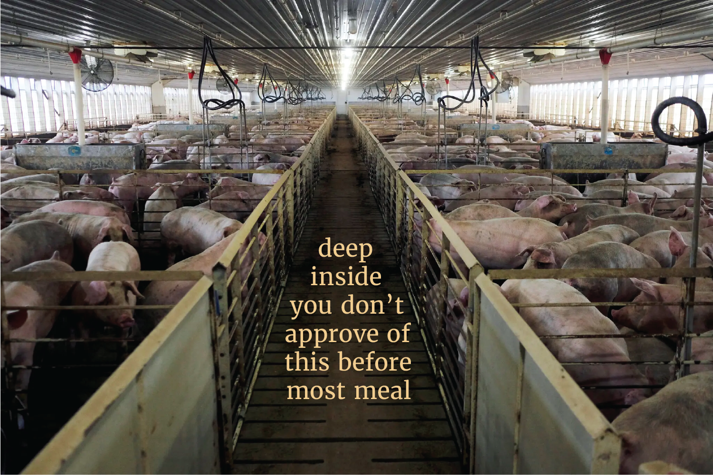

# A sticker to speak to the innate nature of humans to refrain from causing immense animal suffering 

94% of mammal biomass on this planet (excluding humans) is livestock. 

## Putting agriculture & animal agriculture into climate change context...
Citing from [[AGRICULTURE-A]]: Agriculture contributes about 25% of  all greenhouse gas (GHG) emissions, and about 80% of  that comes from products of  animal agriculture such as meat, milk, and eggs. The agriculture industry has major impacts on the environment, as live-stock production accounts for 70% of  all agricultural land and 30% of  the land surface [...] Another 25% of  greenhouse gases are from electricity and heat.

