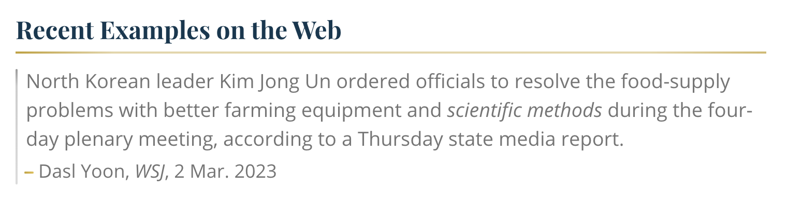

# One building block for Philosophy of Science

"every form of acquiring knowledge is just a form of story telling that adhered to its own guidlines of validity" - Reem

"science needs to be more scientific by investigating the various posibillities in an undogmatic way. and reason, too, should not be dogmatic" #philosophy-of-science problematic: if we don't see the assumptions we have made, we don't see the limitations of the model (McGilchrist 2021)

- say "references" instead of sources

(vanasupa & barabino 2021) 

## what does this mean for academic communication?
*from a conversation with Ciara*: I think standards are incredibly important. I just wish that we could come together and contemplate these standards. How do we want to talk to each other? If one interest of the social sciences is  "intellectual development and communication," what do we envision for the shape of academic papers (Vanasupa & Barabino 2021)? If the critical sciences seek some sort of liberation, what does that mean for our papers?

Currenlty, the standard "paper methodolgy" seems to have arisen from the monologue-style analytical, technical paper realm. But if particular sciences like the critical and social sciences 

________
#MMS #publicBubble
#philosophyOfScience #sticker
________
McGilchrist, I. (2021). The Matter With Things: Our Brains, Our Delusions, and the Unmaking of the World (p. 1500). Perspectiva.

Vanasupa, L., & Barabino, G. (2021). An engineering education of holism: einstein’s imperative. In M. Bouezzeddine (Ed.), Insights into global engineering education after the birth of industry 5.0. IntechOpen. https://doi.org/10.5772/intechopen.99211
