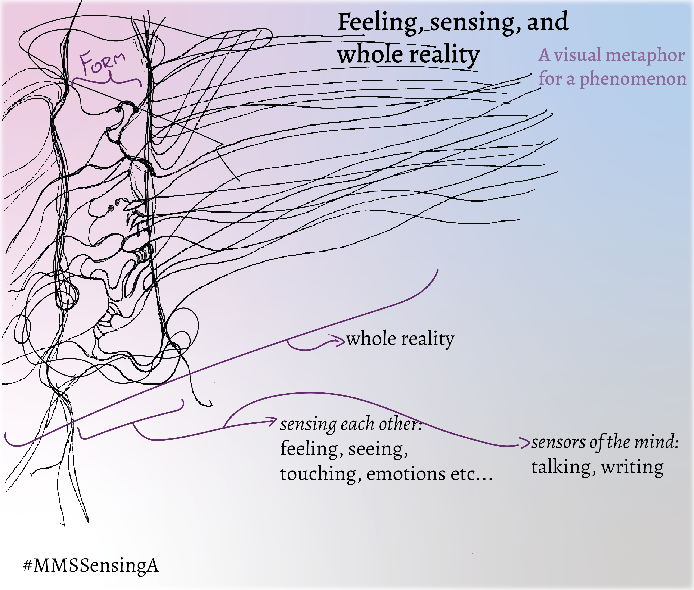
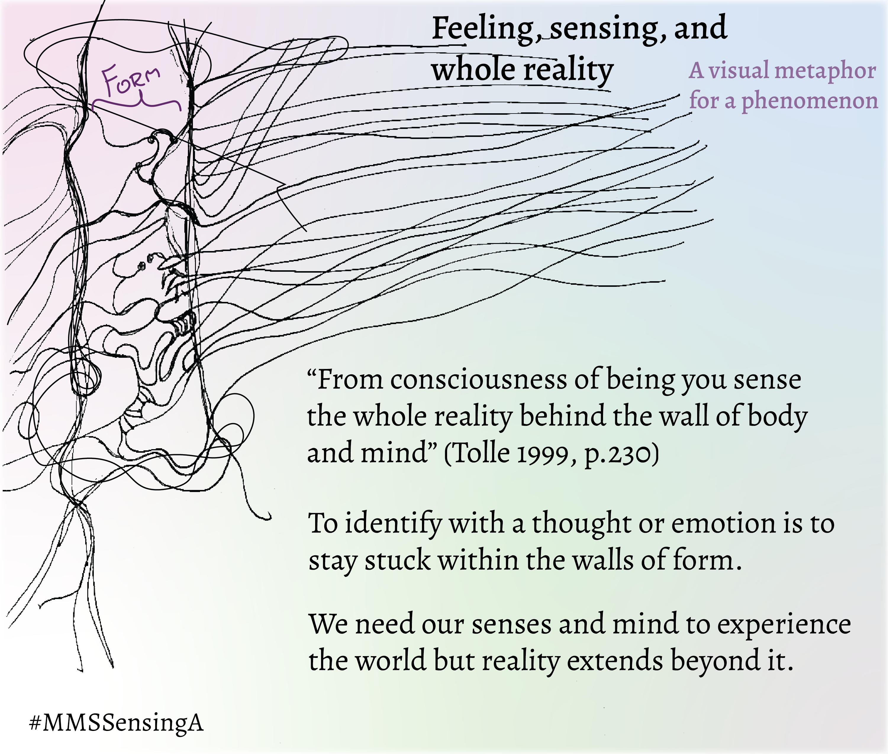
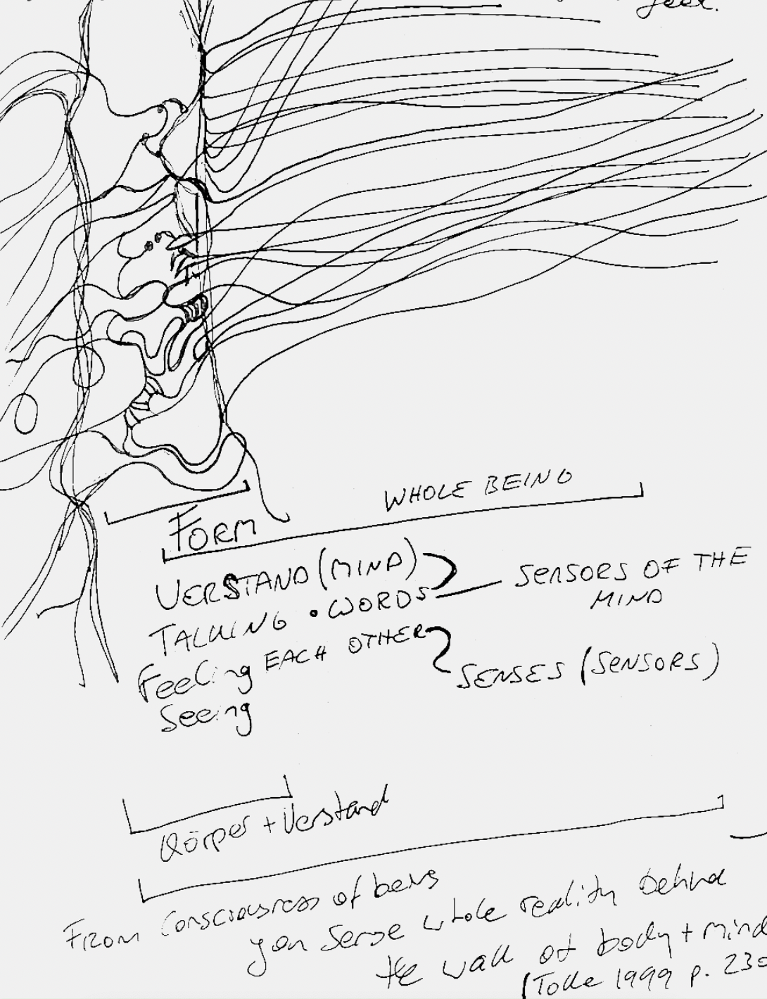
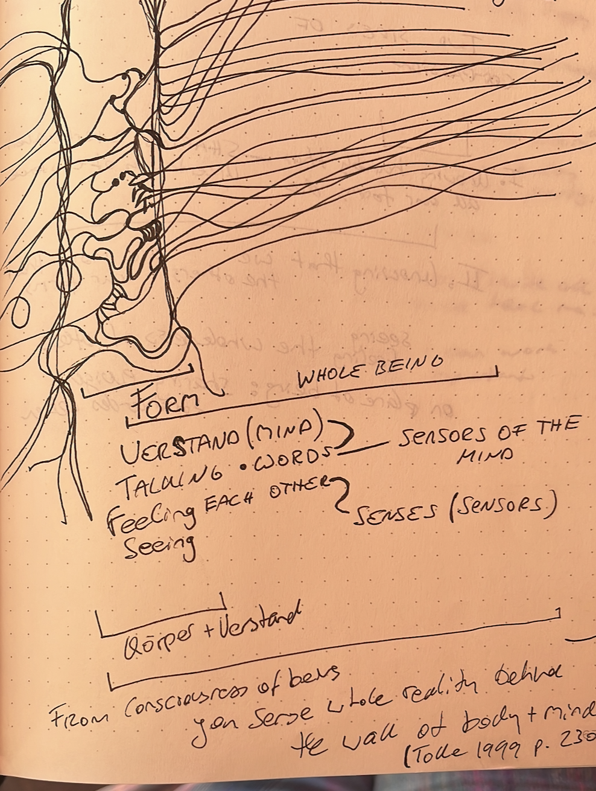
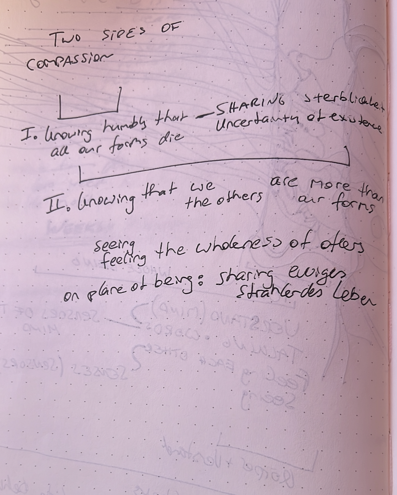

# A visual methaphor for the process/phenomenon of sensing our world and feeling the whole reality

I explore the idea sensing our world and tuning into deeper forms of being in my blog post on [community mapping](https://www.omprakash.org/blog/leon-capstone-blog-week-6-community-mapping).

EDIT: instead of "sensing each other": maybe one side senses the other side and then have arrows instead of a bracket

EDIT: title: how form is part of experience but our whole reality extends beyond it  - a visual metaphor for a phenomenon described by eckhard tolle 

#sensing-the-system-from-within #compassion

## Original Drawings

___
Tolle, E. (1999). The Power of Now: A Guide to Spiritual Enlightenment (1st ed., p. 208). New World Library.

Scharmer, O., & Kaeufer, K. (2013). Leading from the Emerging Future: From Ego-System to Eco-System Economies (1st ed., p. 304). Berrett-Koehler Publishers.
