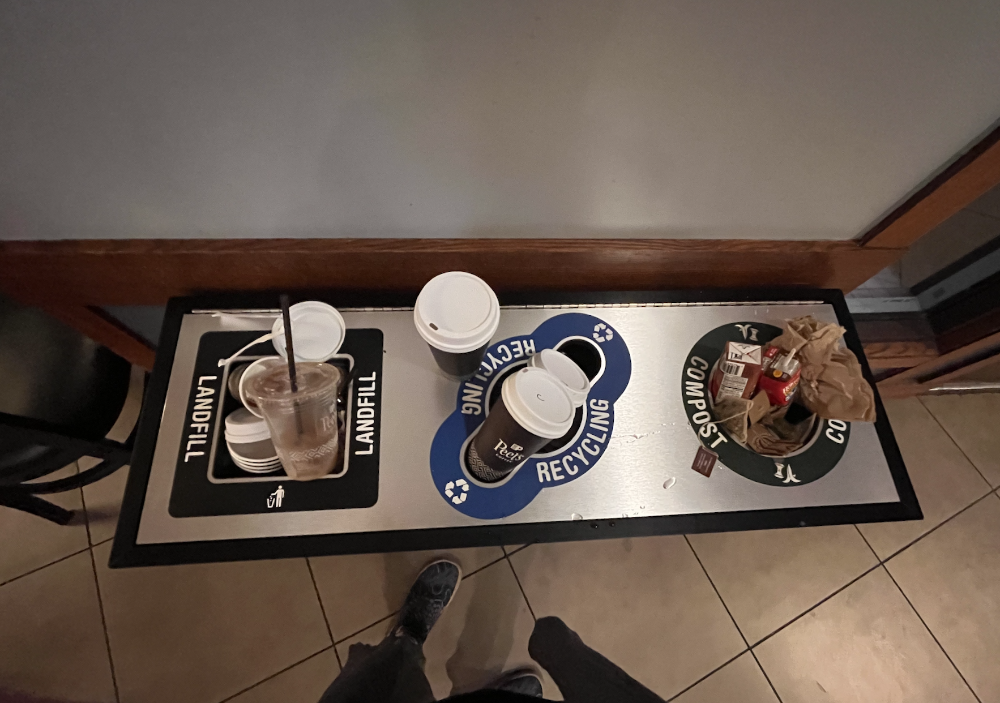

# can public places please compost & recycle?
I feel so much pain when I have to use a to-go container in a coffee shop. I feel pain when I cannot compost my napkins. This sticker addresses this large-scale problem.

However, does it blame the wrong group of people? If I truly wanted system-scale change, I'd have to address people who infuence the law. But social containers like coffe shops are like resonanance chamber for values. 

at Peet's Coffee 

________
#sticker 

________