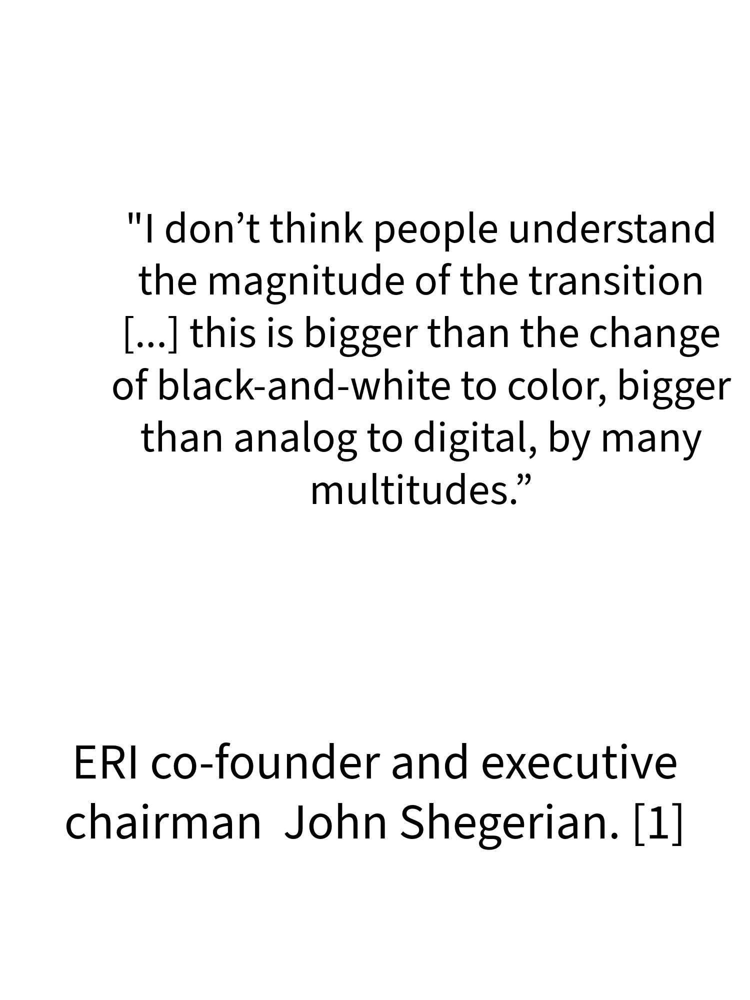
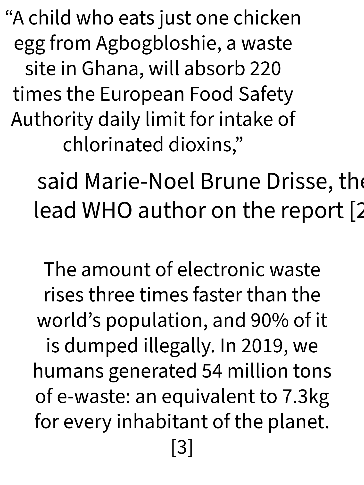
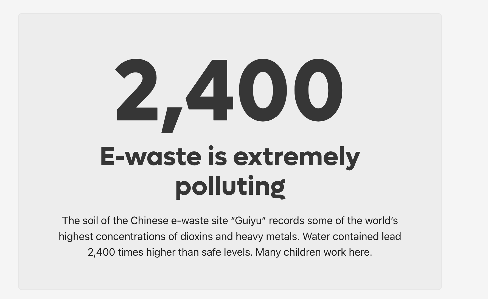
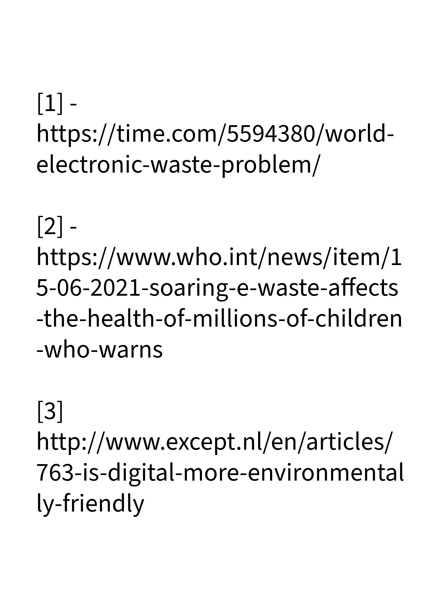
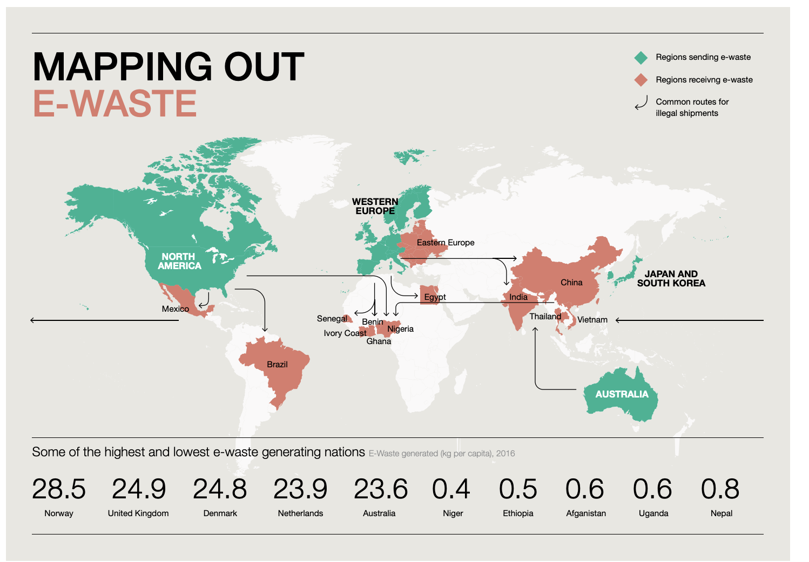

# Quotes and insights around E-Waste

https://new.express.adobe.com/id/urn:aaid:sc:US:e635e7ce-79d7-4f0b-939d-3d6f578c8429?invite=true&promoid=XXTQGVMK&mv=other

from: the world counts

## other good sources on e waste

--> my personal podcast script which is a summary of this page https://docs.google.com/document/d/1KW4JmGWly2oc1lUrpwkvpdrfDeMdYsv7JA6o3CAmGH8/edit?usp=sharing

https://www3.weforum.org/docs/WEF_A_New_Circular_Vision_for_Electronics.pdf

There is 100 times more gold in a tonne of smartphones than in a tonne of gold ore. The earth’s richest deposits of valuable materials are sitting in landfill sites or people’s homes.

________

#electronics-waste #e-waste
________