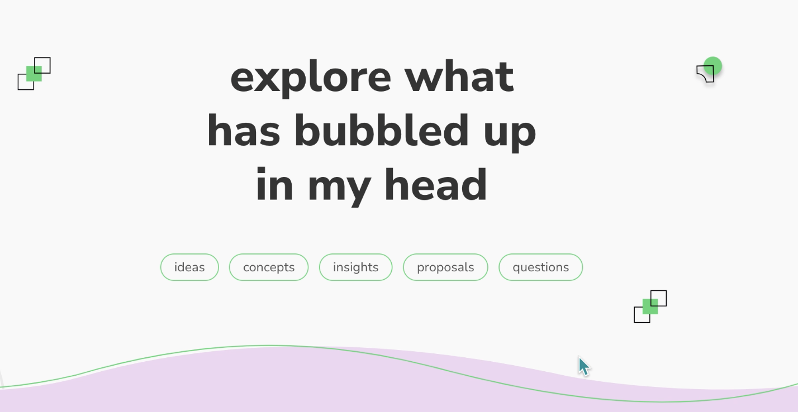

# Resources for notetaking

*From talk with Jaguar*

- [Jaguars little gems & insights for notetaking](https://www.kriste11er.com/digital-hygiene.html)
- Jekyll is an environment to build websites (could be good to use for converstion from markdown to HTML)
- Maggie Appleton (https://maggieappleton.com/garden) has taken the metaphor of seedlings and long-term projects to the next level and created this collection of their work which relates to my [[MMSCommuniA]] intentions to share ideas, resources, inspirations, insights etc...
    - here is an example regarding how to [create a second brain](https://maggieappleton.com/basb)

- how to do the technical notetaking for a website? https://maggieappleton.com/metatour

