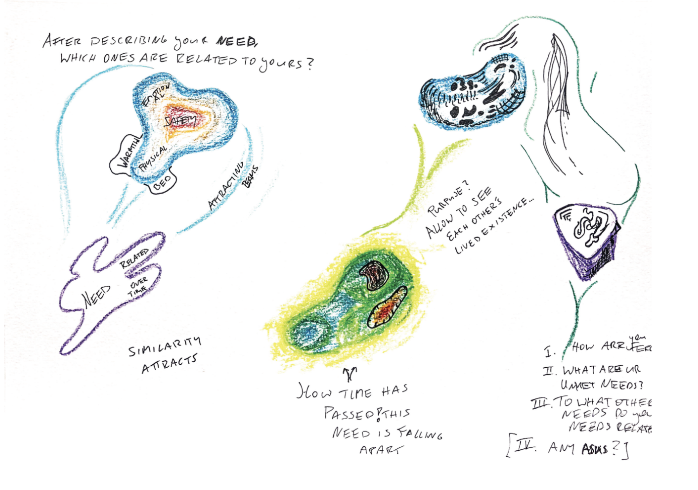

# Visualizing offers, needs, and emotions within the community in a 2D or 3D way with an indicator for time 
I am curious about the visualization of re-occuring themes within a small community. 

Do certain needs of students exist for years? What feelings are associated with these needs? 

The practice of "community sensing" could be faciliated by a general survey that asks about needs (and associated emotions). The size of blobs in the image below could refer to the size of re-ocurrence of similar emotions within the social field of other people. As old needs/emotions stop to re-appear, they may break apart (this could serve as an indicator for change or progress).

As emotions are body-processed language and therefore an access point to embodied knowledge/intelligence, they serve as an opening toward understand needs. There might be a visual opportunity to layer needs around the emergence of emotions (uncertain if it would work out - I'd have to test).

The image below is a playful exploration of visualization of needs in a social field of several people. It is not meant to be a final product. 

