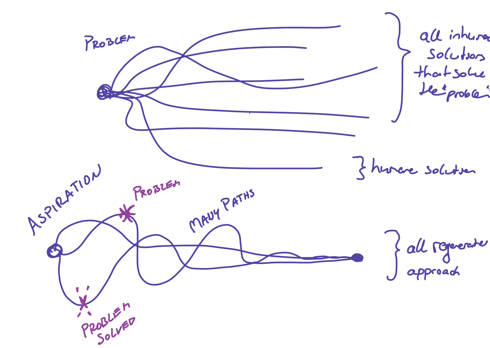
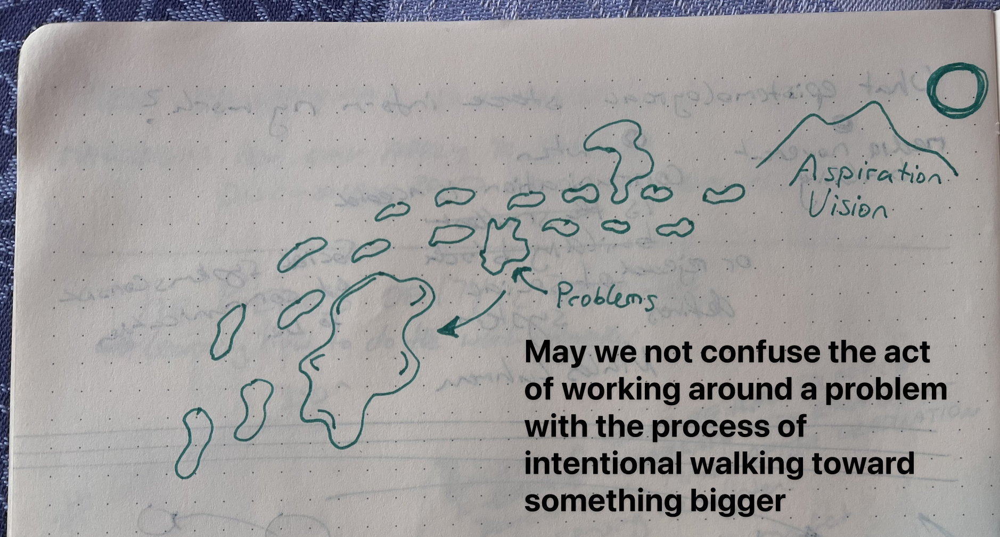

# Solving problems can never be the solution for long-term healing

On a deeper level, I argue that we cannot solve the problem by looking at problems. We should look at what forms of life we aspire to. What ways of being with each other do we aspire to? This very important because even if we solve a problem, new problems will arise. They will arise because we haven't changed our moral and habitual conditioning or the base structure. Only when we grow into new states of being can the root cause of the symptom be fixed. This idea relates to Singers point that we are morally in a somewhat evil situation and we need to unlearn our old habits. We also need make visible hidden mental structures. 

(file in "general" folder in MMS)

## more rambling 
I see the danger in identifying as a problem solver or with the problem itself. I currently think that we always need to remember the values and aspirations behind the problem solving. This might be obvious to social-justice-minded people (like us), but if we don't reflect on the common narrative, we might easily repeat the narrative of being problem-solvers, which is not enough. 

On a personal level, problem-solving mentality is a suffering-oriented perspective on life. So we need to choose who gets to decide the problem (as you know). I once did this exercise for an entrepreneurship class to walk around for one hour and write down all the problems I see around me (that could be fixed). Everyone in this class felt shitty after it. It's not a conducive-to-wellbeing way to approach the world. Instead, we can look at opportunities or those energies that draw us in. We can be present with pain. WE NEED TO! All I'm saying is that attention to words and ways we label ourselves (identity) is very important. We are more than problem solvers! Let's think about how we want to say that... 