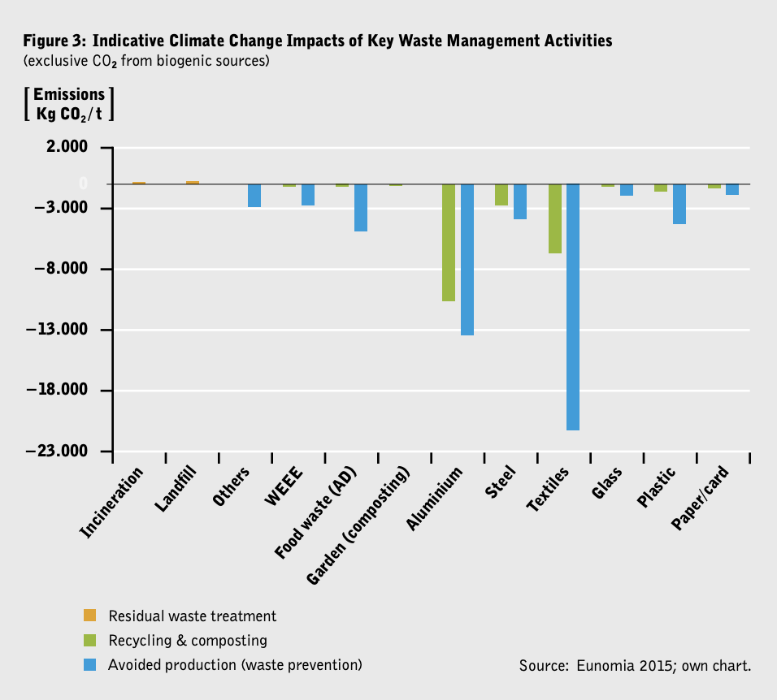

# Avoided CO2 emission for recycling & avoided production for various materials 

"Textiles, aluminium, food waste and plastic are among the top waste streams that can be critical to climate change mitigation, if reduced.6 **In textiles production for example, greenhouse gas emissions totalled 1.2 billion tonnes of CO2 equivalent in 2015, more than those of all international flights and maritime shipping combined**, mainly due to the fast fashion nature of global production and consumption rates of clothing products. If only the average number of times a garment is worn were doubled, GHG emissions would be 44% lower.7 A zero waste circular economy for textiles including high rates of clothing utilization, improved recycling, and reduced waste in production would reduce the negative impacts.

Similarly, the benefits from food waste prevention are significant: to the extent that separate collection of food waste can give rise – in both households and businesses – to enhanced awareness of what is thrown away (hence motivating a preventive effect), the benefits of such an approach become even greater. Data used to elaborate Figure 3 indicate that every tonne of prevented food waste saves 4.5 tonnes CO2 eq." (Heinrich Boell Stifuting Vol 44, p. 11 f.)

________
#MMS-seed : the text in bold
________
REFERENCES

Heinrich Boell Stiftung. Radical Realism for Climate Justice - Zero Waste Circular Economy A Systemic Game-Changer to Climate Change. https://www.boell.de/sites/default/files/radical_realism_for_climate_justice_volume_44_3.pdf