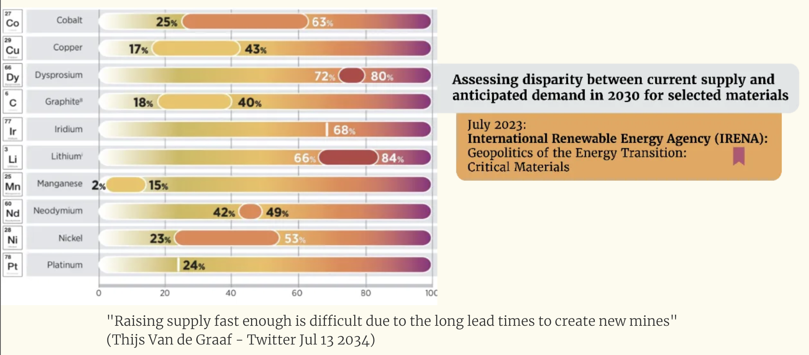

# The energy transition requires massive mining which leads to desastrous outcomes

## It is totally unclear if investment is high enought to yield the materials we need

link to graphic here: https://www.omprakash.org/blog/pollution---violence-embedded-in-rena

## Even if investment is high enough, it is unclear if the energy transition increases justice and sustainability

https://www.wired.co.uk/article/lithium-batteries-environment-impact