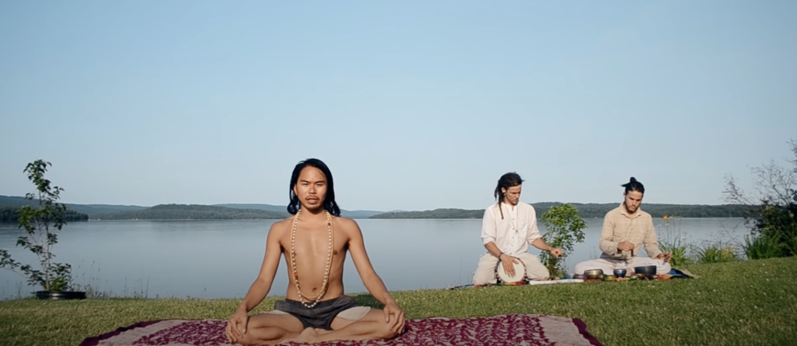
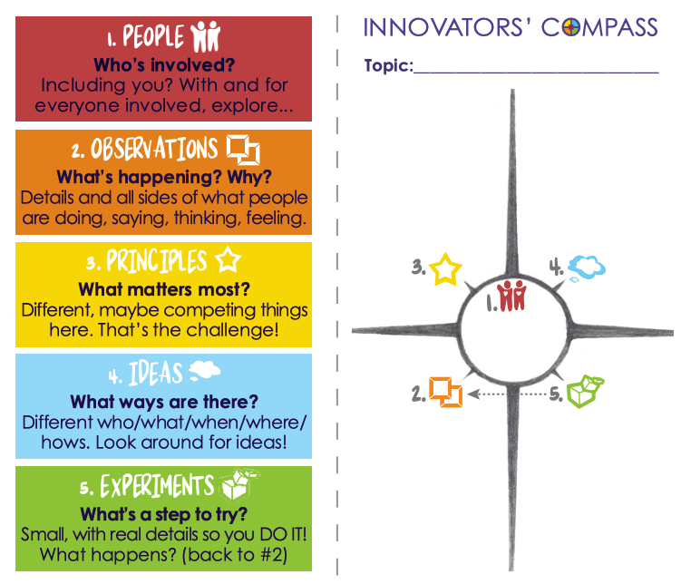
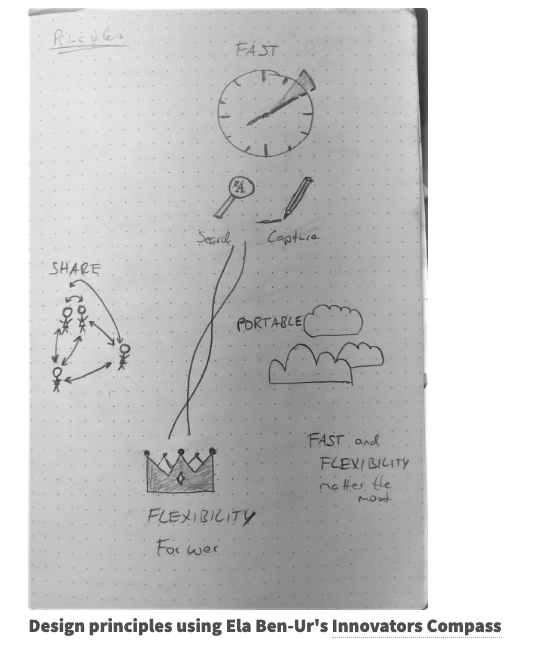

# Practices for energy, flow of qi, loosening, and reflection
Hi Seth, the first to practices are the ones I added to your plan. The third one is an interesting qigong exercise my friend showed to me, and I wanted to pass it along to you. 

## Kundalini Yoga 30 min
This exercise is meant to get your qi flowing and activate your chakras, especially the root chakra. I like it because it an energizing stretching exercise that faciliates a peaceful meditation because my energy feels less stuck and my body is looser after the movements describes. It also helps me with shoulder mobility and upper body strength. Might be good for your upper body as well. Some of the exercises are hard. Try to do them as long as you can. 

[Raw Kundalini Yoga Video with Yogi Emmanuelle
](https://www.youtube.com/watch?si=dH0dzXLMzeN_QVSo&v=x9tRMpOSC_o&feature=youtu.be)

## Innovators Compass [link here](https://innovatorscompass.org/use-it#quickstart)
This tool can be very helpful for taking a step back and reflecting on a particular *threshold area* of your life. It is meant to get the flow going and help you refine your reflection. Roughly take 5 minutes for every step. If you're faster that's ok. Sometimes, it takes a second for people to get into the new space of each part. Just give yourself some time.  

- First, think about your area where you seek to progress or feel stucked.
- Start by drawing a small circle and an intersecting cross as below onto a bigger piece of paper. 
- Then, go through the different numbers.
- 1: who's involved goes into the center. What people relate to this area? Whom would you like to keep in mind. 
- 2: **Observations**: reflect on what has been and is happening. Why are things happening this way. 
- 3: **Principles**: this is a form of synthesis. Bringing together. What principles or values matter most to you within this field of interest? What principles would you like to keep in mind? These could also be called "design goals" in particular circumstances. It can be nice to draw little icons to represent your principles visually (see my image attached below)
- 4: **Ideas**: come up with a variety of ideas that live as overaching solutions to your struggle or can help you go through the threshold space. This is ideation. Brainstorming solutions. Generative. 
- 5: **Experiments**: bring it back to your life. Be concrete. THe goal here is to find just *one step* forward. This is not a whole plan for the next month. It is the first thing you can try out to understand the situation better or progress in a meaninful way. --- On a theoretical level, this part always reminds me of Otto Scharmer's change management insight that if you immersive yourself in something unknown, you don't know what will be on the other side. But it is necessary to immerse yourself to progress. And oftentimes, after you did the first unknown step, you have a new perspective which will inform your next step (but you could not have planned the second step). --- chose one experiment and commit to doing it. You may write down a few and then choose one. Of course, if you're excited to choose two, that's ok. 

I'd love for you to share how this goes once you've done it. If it makes sense or is too much structure for you <3 

