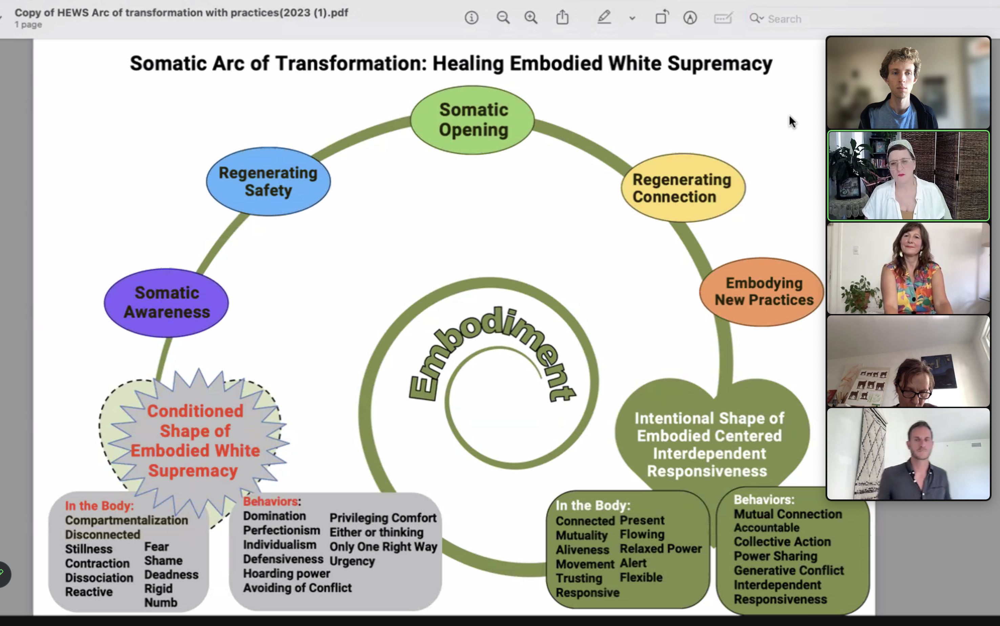

# Healing internalized white-supremacy start with healing the relationship to ourselves

Sue from healingembodiedsupremacy: "for colonization to happen, a disconnect between body & mind needed to happen

How do we live more below the neck and change change from the body and up?
The more our movements can be embodied, the more we can replicate sustainable change."

Dona Hirschfield-White: "a relaxed body is a powerful body"

[1]: https://linktr.ee/healingembodiedsupremacy