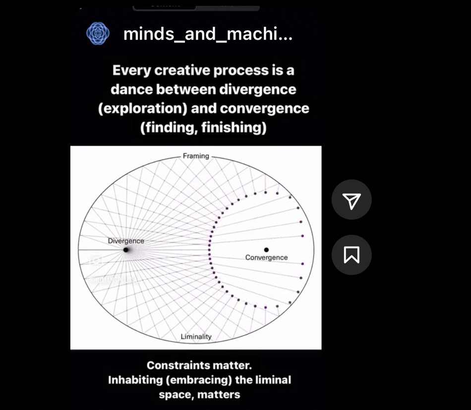

# The relationship between working with oneself and working together

we can only work with others if we work know how to work with ourselves • the swirls can only interact when they exist on both ends • every swirl tornado swirls around a still center, just like real tornados

we need to learn how to "work with ourselves" which is the action that arises out of the compression. i keep coming back to learning how "work with ourselves" - it seems essential in contributing to change but we mostly get taught knowledge but does not set us up to learn how to take notes, process emotions, explore ideas, deal with frustration in our work & life

This illustration also lives on page D-4 of my paper on [How can we transform ourselves? - Spirituality and ecological justice](http://www.leonsanten.info/contemplatingChangeForEJ.html).

#improvement #illustration : draw such that swirls create new tornados that have a still center

--> the smaller and larger forms of working with ourselves relate to adaptive concentric circle ideas mentioned in the IPCC report AR6 [[ADAPT-CYCLES-A]]
## 
#divergence #compression #creativity 

