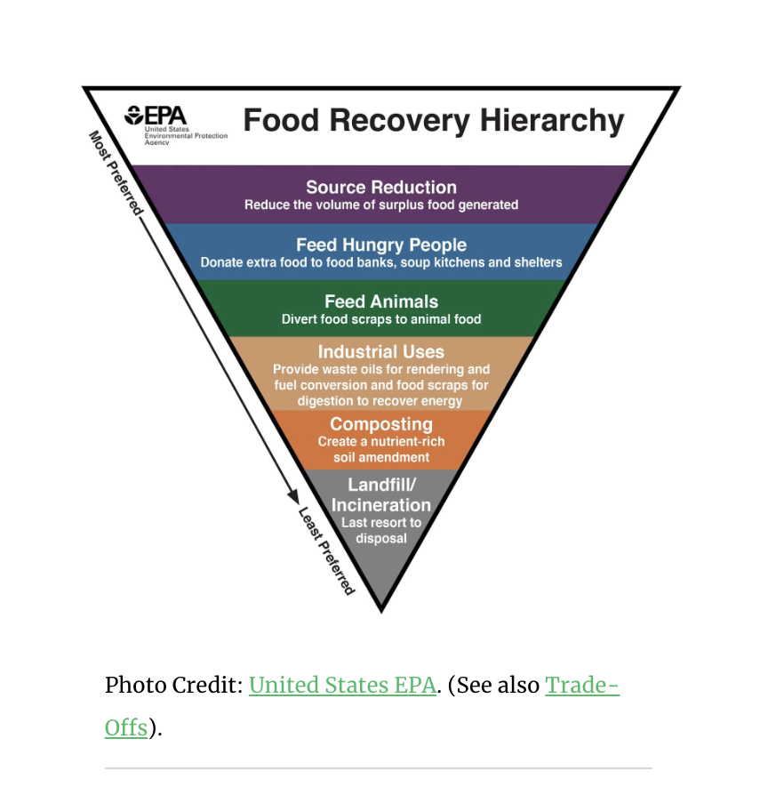

# Food Waste Overview

"Up to 40% of all food produced goes uneaten, and about 95% of discarded food ends up in landfills" - Harvard Public School of Health (2019)[1]

"[Food] is the largest component of municipal solid waste at 21%" - Harvard Public School of Health (2019)[1]

--> [Environmental impact of food waste](https://moveforhunger.org/the-environmental-impact-of-food-waste)

## Food packaging 

--> [The Environmental Impact of Food Packaging](https://foodprint.org/issues/the-environmental-impact-of-food-packaging/)

# Solutions

## Food recovery hierachy 

--> [Roadmap to reduce US food waste by 20 percent](https://refed.org/downloads/Key_Insights.pdf)

______________
REFERENCES

[1] https://www.hsph.harvard.edu/nutritionsource/sustainability/food-waste/ 