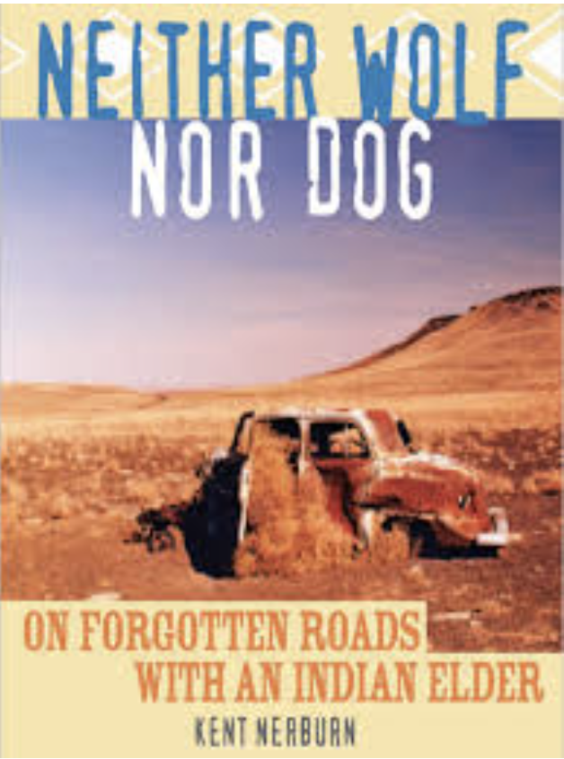

# An excerpt from "Neither Wolf nor Dog": why do Indians keep so much trash on their land if it could be so easy to clean it up?

I had always been mystified by the willingness of people to live in squalor, when only the simplest effort would have been required to make things clean. Eventually, I had come to shrug it off to the old sociological canard that it reflected a lack of self-esteem and a sense of hopelessness about life. But, in my heart, I knew that this was too facile, too middle-class in its presumptions. But it certainly was preferable to earlier explanations — that people who lived like this were simply lazy and shiftless. I wanted to ask Dan. I was sure he'd have a point of view. But I hesitated: the question seemed to run to the heart of the contemporary Indian life.

I needn't have worried, though. The old man saw me glancing around and came right to the point himself. “Bothers you, doesn't it,” he said.

We passed a house with a burnt-out station wagon lying on its side in the front yard.

“Yeah. I guess so,” I answered. “I just don't understand it.” [...]

[Dan] pointed at another of the passing houses. The top of an old Plymouth protruded from a patch of weeds. “What do you see when you look out there?”

“Do you really want to know?”

“I asked, didn't I?”

“I see lack of concern for the land that you claim to revere.”

“You mean, you see a bunch of shit, right?” His candor was liberating.

“Yes.”

“That's what all white people see. You drive through our reservations and say, ‘Look at all the junk cars and all the trash.’ What do you think we say when we drive through one of your cities?”

“I really don't know.”

“We say the same thing. Just because you have everything scrubbed down and in order doesn't mean anything. What is bigger trash, a junk car or a parking ramp? We can tow the junk car away. The parking ramp has to be torn down with bulldozers and wrecking cranes. The only reason you don't see it as trash is that you still use it. When you don't need a building anymore, or it is too expensive to fix, then it is trash. To us it looks like trash all the time.” [...] 

“Still, it wouldn't take anything to clean it up.”

“Maybe we're still using it. That was the Indian way. Use every part of the buffalo. Make ropes from its hair. Make drumsticks from its tail. Some of these people are making one car out of a lot of them. I'm making a dog house out of mine.”

“Junk cars aren't buffalo carcasses.”

“Same thing.”

“That's bullshit.”

“Bullshit!” he exploded. “I'll tell you what is bullshit! White people's attitude toward possessions is bullshit! [...] Owning things is what white people's lives are about. I watch TV, and every ad I see tells me something is ‘new’. That means I should get it because what I have is old and this is new. That's no reason to get something, just because it's new. Your way teaches people to want, want, want. What you have is no good. What you don't have is new and better. From the first you are told, ‘This is mine, this is yours’; ‘Don't touch that, it doesn't belong to you.’ You are taught to keep away from things because of ownership, not because of respect. In the old days we never had locks on our doors. There was no stealing, but if someone was hungry, they could go in your house and get food. That was all. Why didn't people take things? Because of respect. You build fences around your yards and pay money for people to measure the ground to tell you if your neighbor's fence is one inch too close to your house. You give nothing away unless you can get something in return. Everything is economic. Your most powerful people don't even hide their thinking on this. If you ask for something, they don't ask whether you need it; they say, ‘What's in it for me?’”

“I'm afraid that's America, Dan,” I said.

He hammered the air with his gnarled fist. “I know it. [...] We have to live in this world. The Europeans killed all the animals and took all our land. We can't live our way anymore. We have to live your way. In our way, everything had its use then it went back into the earth. We had wooden bowls and cups, or things made of clay. We rode horses or walked. We made things out of the things of the earth. Then when we no longer needed it, we let it go back into the earth. Now things don't go back into the earth. Our kids leave pop cans around. We leave old cars around. In the old days these would be bone spoons and horn cups, and the old cars would be skeletons of horses or buffalo. We could burn them or leave them and they would go back to the earth. Now we can't. We are living the same way, but we are living with different things. We will learn your way, but, you see, you really don't understand any better. All you really care about is keeping things clean. You don't care how they really are, just so long as they are clean. You see a dirt path with a pop can next to it and you think that is worse than a big paved highway that is kept clean. You get madder at a forest with a trash bag in it than at a big shopping center that is all clean and swept.

“It all comes back to possessions. You want to have everything and you think that is fine as long as it is put in piles or in rooms or in boxes with labels. We don't have very much and we leave it when we don't want it or need it.

“If I lived in a big house and had rooms full of different things, if I had big cars and a library full of books, if I had pulled out all the flowers and medicine plants and made a lawn that looked like a rug, people would come to me and ask me about everything because they would say I am a ‘good’ Indian. All it would mean is that I am an Indian with lots of possessions, just like a white man. That would make me good and important in your eyes. Admit it.

“Every once in a while I would have to go to a powwow and put on some feathers so you could believe I was a real Indian. But other than that you would think I was smarter and more important if I lived in a big house and owned lots of things. That's just the way white people are. It's the way you are trained.”

Source: Nerbun, K. (2002) Neither Wolf nor Dog. New World Library.